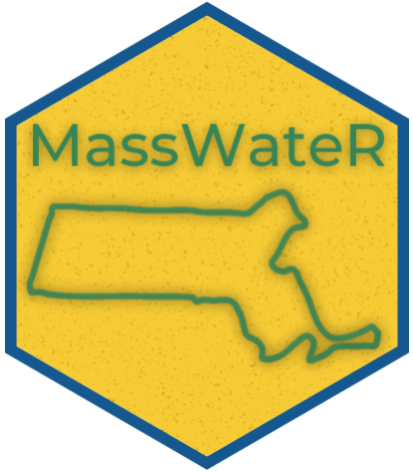

# MassWateR

[](https://github.com/massbays-tech/MassWateR/actions)

R package for working with Massachusetts surface water quality data, created in partnership by the [Mass Bays National Estuary Partnership](https://www.mass.gov/orgs/massachusetts-bays-national-estuary-partnership).



## Installation

The package can be installed as follows:

``` r
install.packages('devtools')
devtools::install_github('massbays-tech/MassWateR')
```

## Issues and suggestions 

Please report any issues and suggestions on the [issues link](https://github.com/massbays-tech/MassWateR/issues) for the repository.

## Contributing 

Please view our [contributing](https://github.com/massbays-tech/MassWateR/blob/master/.github/CONTRIBUTING.md) guidelines for any changes or pull requests.

## Code of Conduct
  
Please note that the MassWateR project is released with a [Contributor Code of Conduct](https://contributor-covenant.org/version/2/0/CODE_OF_CONDUCT.html). By contributing to this project, you agree to abide by its terms.