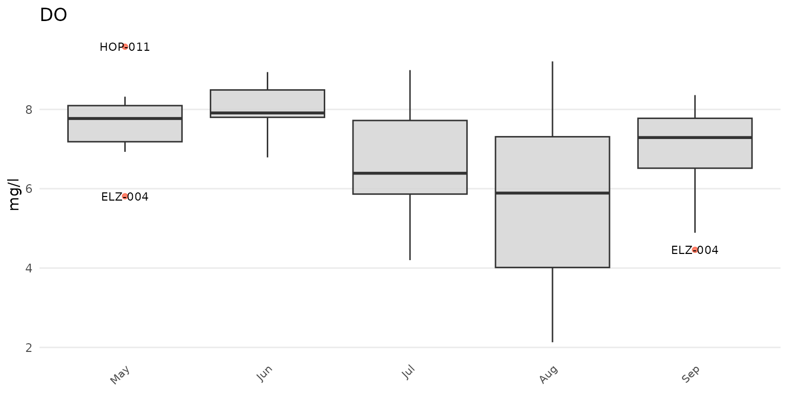

# MassWateR quick start

## Overview

The MassWateR R package is developed for surface water monitoring data
collected by watershed associations and citizen science groups in
Massachusetts. The package is created in collaboration with the
[Massachusetts Bays National Estuary Partnership](https://massbays.org/)
with funding from an EPA Exchange Network Grant (Grant
No. OS-84029801-0).

The objective of the package is to automate and facilitate quality
control and exploratory analysis of data intended for upload to the EPA
[Water Quality
Exchange](https://www.epa.gov/waterdata/water-quality-data) (WQX). The
functions provide a streamlined and repeatable means of 1) screening
data for quality control, 2) summarizing quality control results, 3)
creating graphics for analysis and reports to stakeholders, and
4)formatting data for upload to WQX. The functions are organized around
these topics, shown below.


Functions in MassWateR are organized around these topics.

In addition to the content on this web page, the MassWateR Community of
Practice forum is a space for users to find help, share ideas, and
suggest improvements for the package. Please follow the
[link](https://massbays.discourse.group/c/masswater-r-tools/5) to
register and login to the forum.

Instructions on installing R and Rstudio can be found
[here](https://massbays-tech.github.io/intro-to-r/setup.html) and on the
[Resources](https://massbays-tech.github.io/MassWateR/RESOURCES.html)
tab.

## Package installation

Install the package as follows:

``` r
# Install the package
install.packages("MassWateR")
```

Windows PC users may encounter the following warning when installing
MassWateR.

``` r
WARNING: Rtools is required to build R packages but is not currently installed. Please download and install the appropriate version of Rtools before proceeding: https://cran.r-project.org/bin/windows/Rtools/
```

This warning can be ignored. If desired, RTools can be obtained
following the instructions
[here](https://cran.r-project.org/bin/windows/Rtools/).

Load the package in an R session after installation:

``` r
library(MassWateR)
```

## Data inputs

Please view the [data inputs and
checks](https://massbays-tech.github.io/MassWateR/articles/inputs.html)
vignette for a complete description of the data requirements for
MassWateR.

Five types of data are used with the MassWateR package: surface water
quality results, data quality objectives (for accuracy, frequency, and
completeness), site metadata, wqx metadata, and censored data.

The following shows how to specify a path and import each required data
file. These are hypothetical files and the path will need to be changed
to where your data are located on your computer. Templates with
instructions for each of the types of input data are available for
download in the [Resources
tab](https://massbays-tech.github.io/MassWateR/RESOURCES.html).

``` r
# import results data
respth <- "C:/Documents/MassWateR/MyResults.xlsx"
resdat <- readMWRresults(respth)

# import dqo accuracy data
accpth <- "C:/Documents/MassWateR/MyDQOAccuracy.xlsx"
accdat <- readMWRacc(accpth)

# import dqo frequency and completeness data
frecompth <- "C:/Documents/MassWateR/MyDQOFreCom.xlsx"
frecomdat <- readMWRfrecom(frecompth)

# import site data
sitpth <- "C:/Documents/MassWateR/MySites.xlsx"
sitdat <- readMWRsites(sitpth)

# import WQX meta data
wqxpth <- "C:/Documents/MassWateR/MyWQXMeta.xlsx"
wqxdat <- readMWRwqx(wqxpth)

# import censored data
censpth <- "C:/Documents/MassWateR/MyCensored.xlsx"
censdat <- readMWRcens(censpth)
```

After data are imported, a single data object can be created that can be
used with all MassWateR functions.

``` r
# a list of input data frames
fsetls <- list(res = resdat, acc = accdat, frecom = frecomdat, sit = sitdat, wqx = wqxdat, 
               cens = censdat)
```

The
[`readMWRresultsview()`](https://massbays-tech.github.io/MassWateR/reference/readMWRresultsview.md)
function can be used to help troubleshoot issues that are encountered
importing the water quality results file. This function can be used to
create a .csv spreadsheet that shows the unique values within columns of
the results file. This information can be used to verify if the values
in each conform to the requirements for the data import checks.

``` r
readMWRresultsview(respth = respth, output_dir = getwd())
```

## Outlier checks

Please view the [outlier
checks](https://massbays-tech.github.io/MassWateR/articles/outlierchecks.html)
vignette for a complete description of the outlier check functions in
MassWateR.

The
[`anlzMWRoutlier()`](https://massbays-tech.github.io/MassWateR/reference/anlzMWRoutlier.md)
function can identify outliers for a selected parameter using boxplots,
with the outliers labelled accordingly.

``` r
anlzMWRoutlier(fset = fsetls, param = "DO", group = "month")
```



Outlier plots for all parameters in the results data file can be created
using the
[`anlzMWRoutlierall()`](https://massbays-tech.github.io/MassWateR/reference/anlzMWRoutlierall.md)
function. This can be used to create a word document with all plots
embedded in the file or as separate png images saved to a specified
directory. Once the function is done running, a message indicating
success and where the file(s) is located is returned.

``` r
anlzMWRoutlierall(fset = fsetls, group = "month", output_dir = getwd())
```

## Quality control functions

Please view the [quality control
functions](https://massbays-tech.github.io/MassWateR/articles/qcoverview.html)
vignette for a complete description of the quality control functions in
MassWateR.

The
[`qcMWRreview()`](https://massbays-tech.github.io/MassWateR/reference/qcMWRreview.md)
function compiles a report as a Word document for all quality control
checks included in the MassWateR package. The report shows several
tables, including the data quality objectives files for accuracy,
frequency, and completeness, summary results for all accuracy checks,
summary results for all frequency checks, summary results for all
completeness checks, and individual results for all accuracy checks.

The report can be created as follows. Once the function is done running,
a message indicating success and where the file is located is returned.
The Word file can be further edited by hand as needed. A spreadsheet of
the tables can also be created by adding `savesheet = TRUE` to the
function call.

``` r
qcMWRreview(fset = fsetls, output_dir = getwd())
```

## Analyses

Please view the
[analyses](https://massbays-tech.github.io/MassWateR/articles/analysis.html)
vignette for a complete description of the analysis functions in
MassWateR.

The analysis functions in MassWateR can be used to evaluate trends,
summaries, and maps.

Analyze results by season:

``` r
anlzMWRseason(fset = fsetls, param = "DO", thresh = "fresh")
```


Analyze results by date:

``` r
anlzMWRdate(fset = fsetls, param = "DO", thresh = "fresh", site = c("ABT-026", "ABT-077"))
```


Analyze data by site:

``` r
anlzMWRsite(fset = fsetls, param = "DO", thresh = "fresh")
```


Analyze results with maps:

``` r
anlzMWRmap(fset = fsetls, param = "DO")
```


## Modifying plots

Please view the [modifying
plots](https://massbays-tech.github.io/MassWateR/articles/modifying.html)
vignette for a complete description of how plots created in MassWateR
can be modified by hand. All of the plots created for the outlier and
general analysis functions are
[ggplot2](https://ggplot2.tidyverse.org/index.html) plots and can be
modified accordingly, in addition to the supplied arguments to the core
functions.

## Water Quality Exchange output

Please view the [Water Quality Exchange
output](https://massbays-tech.github.io/MassWateR/articles/wqx.html)
vignette for a complete description of creating output for WQX upload
with MassWateR.

The single function for generating output for upload to WQX is
[`tabMWRwqx()`](https://massbays-tech.github.io/MassWateR/reference/tabMWRwqx.md).
This function will export a single Excel workbook with three sheets,
named “Project”, “Locations”, and “Results”. The output is populated
with as much content as possible, but it is the responsibility of the
user to verify this information is complete and correct before uploading
the data. Additional information may need to be added by hand. Once the
function is done running, a message indicating success and where the
file is located is returned.

``` r
tabMWRwqx(fset = fsetls, output_dir = getwd())
```

## Submitting data to Mass DEP

If you are submitting your data to Mass DEP, you must follow all of
their instructions as described on their [External Data
Submittal](https://www.mass.gov/guides/external-data-submittals-to-the-watershed-planning-program)
webpage. Data and QC data can be submitted using either the MassDEP data
submission template OR by uploading data to WQX. If you are submitting
through WQX you should complete the submission by notifying Mass DEP via
email ([WQData.Submit@mass.gov](mailto:WQData.Submit@mass.gov)). The
e-mail must include the group name / project name under which the data
was submitted to WQX, a copy of the project QAPP (if not already
submitted), a statement of data integrity, the MassWateR QC Report (with
the raw data print out), and any other supporting data reports.

## Uploading data to WQX

If desired, all rows from the WQX output file (created with
[`tabMWRwqx()`](https://massbays-tech.github.io/MassWateR/reference/tabMWRwqx.md))
can be copied and pasted into the [WQX upload
template](https://github.com/massbays-tech/MassWateR/raw/refs/heads/main/inst/extdata/WQX_Phys-Chem_Template_for_MassWateR.xlsx)
(also available on the
[Resources](https://massbays-tech.github.io/MassWateR/RESOURCES.html)
tab), which offers an enhanced spreadsheet layout with more interactive
functionality (e.g., drop-down lists, prompts) and additional tabs with
supporting information (e.g., instructions, field definitions). This
template is especially useful if manual edits to the data are needed
prior to WQX upload.

To upload data to WQX, you will need to create or sign into [your WQX
account](https://www.epa.gov/waterdata/wqx-web-account-registration).
From there, you can upload your Projects, Locations, and Results
spreadsheets individually. Note that Projects and Locations need only be
uploaded once for your organization, unless the data change. For each
spreadsheet upload, use the appropriate MassWateR custom import
configuration, check that your Organization ID is assigned, browse to
your upload file, and select Import Data (image below). The next screen
will notify you of upload status and prompt you to correct any errors or
warnings that arise. More information on error resolution can be found
in the [WQX User
Guide](https://www.epa.gov/sites/default/files/2020-03/documents/wqx_web_user_guide_v3.0.pdf).


