# MassWateR analyses

The analysis functions in MassWateR can be used to evaluate trends,
summaries, and maps once the required data are successfully imported
into R (see the [data input and checks
vignette](https://massbays-tech.github.io/MassWateR/articles/inputs.html)
for an overview). The results data file with the monitoring data is
required. The data quality objectives file for accuracy is also required
to automatically determine plot axis scaling as arithmetic (linear) or
logarithmic and to fill results data that are below detection or above
quantitation limits. The site metadata file is used to create maps. The
example data included with the package are imported here to demonstrate
how to use the analysis functions:

``` r
library(MassWateR)

# import results data
respth <- system.file("extdata/ExampleResults.xlsx", package = "MassWateR")
resdat <- readMWRresults(respth)
#> Running checks on results data...
#>  Checking column names... OK
#>  Checking all required columns are present... OK
#>  Checking valid Activity Types... OK
#>  Checking Activity Start Date formats... OK
#>  Checking depth data present... OK
#>  Checking for non-numeric values in Activity Depth/Height Measure... OK
#>  Checking Activity Depth/Height Unit... OK
#>  Checking Activity Relative Depth Name formats... OK
#>  Checking values in Activity Depth/Height Measure > 1 m / 3.3 ft... OK
#>  Checking Characteristic Name formats... OK
#>  Checking Result Values... OK
#>  Checking for non-numeric values in Quantitation Limit... OK
#>  Checking QC Reference Values... OK
#>  Checking for missing entries for Result Unit... OK
#>  Checking if more than one unit per Characteristic Name... OK
#>  Checking acceptable units for each entry in Characteristic Name... OK
#> 
#> All checks passed!

# import accuracy data
accpth <- system.file("extdata/ExampleDQOAccuracy.xlsx", package = "MassWateR")
accdat <- readMWRacc(accpth)
#> Running checks on data quality objectives for accuracy...
#>  Checking column names... OK
#>  Checking all required columns are present... OK
#>  Checking column types... OK
#>  Checking no "na" in Value Range... OK
#>  Checking for text other than <=, ≤, <, >=, ≥, >, ±, %, AQL, BQL, log, or all... OK
#>  Checking overlaps in Value Range... OK
#>  Checking gaps in Value Range... OK
#>  Checking Parameter formats... OK
#>  Checking for missing entries for unit (uom)... OK
#>  Checking if more than one unit (uom) per Parameter... OK
#>  Checking acceptable units (uom) for each entry in Parameter... OK
#>  Checking empty columns... OK
#> 
#> All checks passed!

# import site metadata
sitpth <- system.file("extdata/ExampleSites.xlsx", package = "MassWateR")
sitdat <- readMWRsites(sitpth)
#> Running checks on site metadata...
#>  Checking column names... OK
#>  Checking all required columns are present... OK
#>  Checking for missing latitude or longitude values... OK
#>  Checking for non-numeric values in latitude... OK
#>  Checking for non-numeric values in longitude... OK
#>  Checking for positive values in longitude... OK
#>  Checking for missing entries for Monitoring Location ID... OK
#> 
#> All checks passed!
```

## Analyze seasonal trends

Seasonal trends can be evaluated using the
[`anlzMWRseason()`](https://massbays-tech.github.io/MassWateR/reference/anlzMWRseason.md)
function. This function summarizes results for a single parameter using
boxplots or barplots with seasonal groups assigned to months or weeks of
the year. Boxplots or barplots can also include jittered points of the
observations on top or only the jittered points can be shown. Threshold
lines are also shown on the plot to determine if results are near
thresholds of interest. The data that are plotted can be filtered by
sites, dates, result attributes, or location groups (from the site
metadata file).

The
[`anlzMWRseason()`](https://massbays-tech.github.io/MassWateR/reference/anlzMWRseason.md)
function uses the results data as a file path or data frame as input.
The input files are passed to the function using the `res` and `acc`
arguments, but a named list with the same arguments can also be used
with the `fset` argument for convenience. Below, the results for
dissolved oxygen (`param = "DO"`) are grouped by month using
`group = "month"` and as boxplots using `type = "box"`. A description of
the summary statistics shown by a boxplot is provided in the [outlier
checks](https://massbays-tech.github.io/MassWateR/articles/outlierchecks.html#analyzing-outliers)
vignette. The relevant threshold lines for freshwater environments are
shown using `thresh = "fresh"`.

``` r
anlzMWRseason(res = resdat, param = "DO", acc = accdat, thresh = "fresh", group = "month", type = "box")
#> Warning: Using `size` aesthetic for lines was deprecated in ggplot2 3.4.0.
#> ℹ Please use `linewidth` instead.
#> ℹ The deprecated feature was likely used in the MassWateR package.
#>   Please report the issue at
#>   <https://github.com/massbays-tech/MassWateR/issues>.
#> This warning is displayed once per session.
#> Call `lifecycle::last_lifecycle_warnings()` to see where this warning was
#> generated.
```


Jittered points over the boxplots can be shown by setting
`type = "jitterbox"`.

``` r
anlzMWRseason(res = resdat, param = "DO", acc = accdat, thresh = "fresh", group = "month", type = "jitterbox")
```


The same data can also be grouped by week using `group = "week"`. The
week of the year is shown on the plot as an integer. Note that there can
be no common month/day indicating the start of the week between years
and an integer is the only way to compare summaries if the results data
span multiple years.

``` r
anlzMWRseason(res = resdat, param = "DO", acc = accdat, thresh = "fresh", group = "week", type = "box")
```


Barplots can be shown using `type = "bar"`. The barplots show the
average estimate for the results defined by the `group` argument.

``` r
anlzMWRseason(res = resdat, param = "DO", acc = accdat, thresh = "fresh", group = "month", type = "bar")
```


Confidence intervals at 95% for the barplots can be shown by setting
`confint = TRUE`.

``` r
anlzMWRseason(res = resdat, param = "DO", acc = accdat, thresh = "fresh", group = "month", type = "bar", confint = TRUE)
```

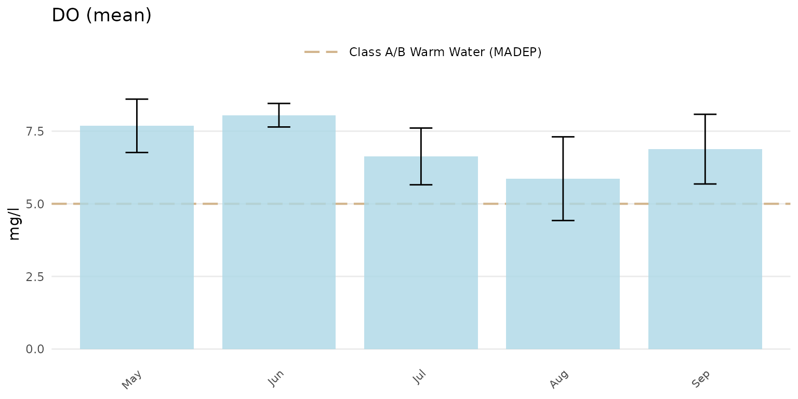

Jittered points over the barplots can be shown by setting
`type = "jitterbar"`.

``` r
anlzMWRseason(res = resdat, param = "DO", acc = accdat, thresh = "fresh", group = "month", type = "jitterbar")
```


Setting `type = "jitter"` will show only the jittered points.

``` r
anlzMWRseason(res = resdat, param = "DO", acc = accdat, thresh = "fresh", group = "month", type = "jitter")
```


The threshold lines shown on each plot are determined from the
`thresholdMWR` file included with MassWateR. These threshold lines
describe relevant state standards or typical ranges in Massachusetts, if
applicable for a parameter. Thresholds can be plotted for freshwater or
marine environments using the `thresh` argument as `thresh = "fresh"` or
`thresh = "marine"`, respectively. Two threshold lines are typically
shown, whereas some parameters may only have one threshold line. Other
parameters have no information in the `thresholdMWR` file and lines will
not be plotted. Threshold lines can be suppressed by setting
`thresh = "none"`. Below, the marine thresholds are shown for dissolved
oxygen using the barplot option grouped by month.

``` r
anlzMWRseason(res = resdat, param = "DO", acc = accdat, thresh = "marine", group = "month", type = "bar")
```


A user-supplied numeric value can also be used for the `thresh`
argument. The `threshlab` argument must also be used to label the custom
threshold in the plot legend.

``` r
anlzMWRseason(res = resdat, param = "DO", acc = accdat, thresh = 8, threshlab = "Custom threshold", group = "month", type = "bar")
```


The y-axis scaling as arithmetic (linear) or logarithmic can be set with
the `yscl` argument. If `yscl = "auto"` (default), the scaling is
determined automatically from the data quality objective file for
accuracy, i.e., parameters with “log” in any of the columns are plotted
on log10-scale, otherwise arithmetic. Setting `yscl = "linear"` or
`yscl = "log"` will set the axis as linear or log10-scale, respectively,
regardless of the information in the data quality objective file for
accuracy. Below, the axis for E. Coli is plotted on the log-10 scale
automatically. The y-axis scaling does not need to specified explicitly
in the function call because the default setting is `yscl = "auto"`.

``` r
anlzMWRseason(res = resdat, param = "E.coli", acc = accdat, thresh = "fresh", group = "month", type = "bar")
```

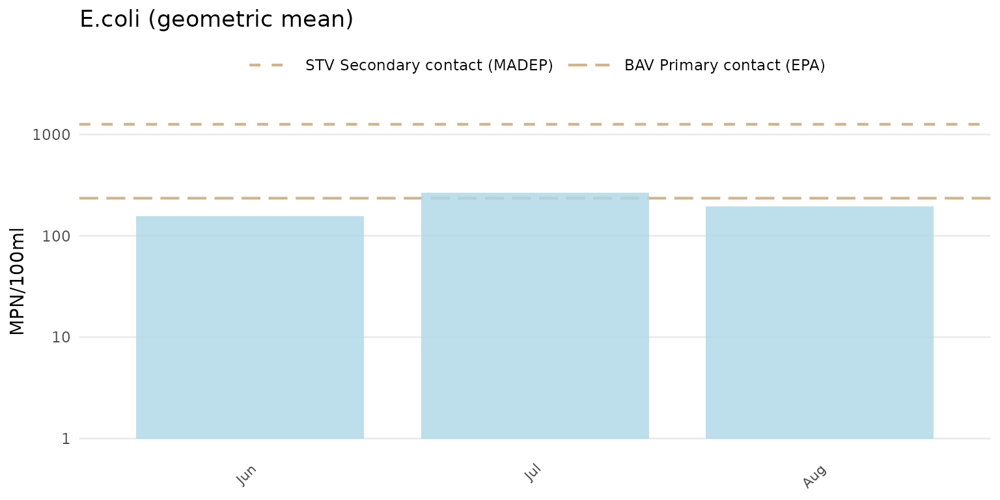

To force the y-axis as linear for E. Coli, `yscl = "linear"` must be
used. Note that the default linear scaling for dissolved oxygen above is
determined automatically. The means and confidence intervals will also
vary between arithmetic and log-scaling if `type = "bar"`.

``` r
anlzMWRseason(res = resdat, param = "E.coli", acc = accdat, thresh = "fresh", group = "month", type = "bar", yscl = "linear")
```


If `type` is `"bar"` or `"jitterbar"`, the data will be summarized using
the mean or geometric mean as appropriate for the parameter based on
information in the data quality objective file for accuracy. By default,
the summary is based on the `yscl` argument. The default can be changed
by passing a value to the `sumfun` argument, where appropriate values
include `"auto"` (automatically as mean or geometric mean using
information in the data quality objective file for accuracy), `"mean"`,
`"geomean"`, `"median"`, `"min"`, or `"max"`. Confidence intervals will
be included if `confint = TRUE` and the summary is automatic or the mean
or geometric mean is used to override the automatic summary. Below, the
median summary is shown for E. coli.

``` r
anlzMWRseason(res = resdat, param = "E.coli", acc = accdat, thresh = "fresh", group = "month", type = "bar", sumfun = "median")
```


Results can also be filtered by dates using the `dtrng` argument. The
date format must be `YYYY-MM-DD` and include two entries.

``` r
anlzMWRseason(res = resdat, param = "E.coli", acc = accdat, thresh = "fresh", group = "month", type = "bar", dtrng = c("2022-05-01", "2022-07-31"))
```


Finally, the results can be filtered by sites, result attributes, and
location groups using the `site`, `resultatt`, and `locgroup` arguments.
These options will filter the results data based on values in the
`Monitoring Location ID` and `Result Attribute` columns in the results
file and by the `Location Group` column in the site metadata file, which
must be provided to the `sit` argument if `locgroup` is used.

``` r
anlzMWRseason(res = resdat, param = "DO", acc = accdat, sit = sitdat, thresh = "fresh", group = "month", site = "ABT-077", resultatt = "DRY", locgroup = "Assabet")
```

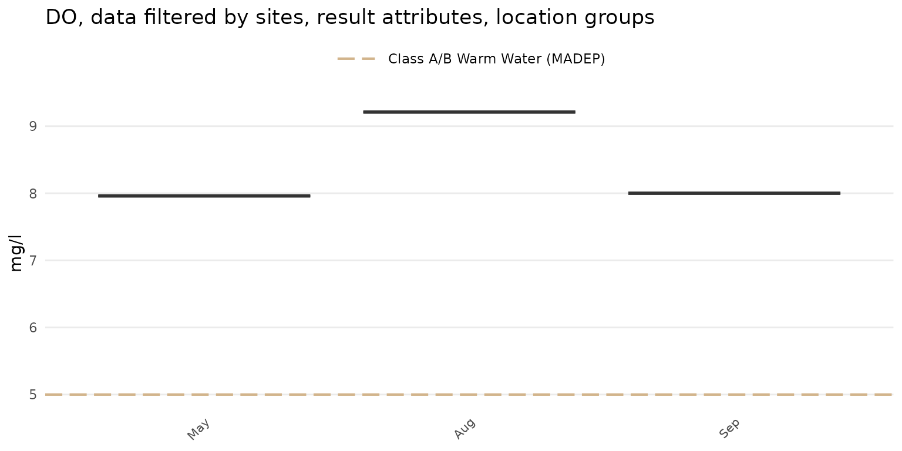

## Analyze trends by date

Trends by date for selected parameters can be evaluated using the
[`anlzMWRdate()`](https://massbays-tech.github.io/MassWateR/reference/anlzMWRdate.md)
function. The plot shows results continuously over time as line plots,
with the lines separated by site, combined across sites, or combined
across location groups. For location groups, the site metadata file must
be supplied. Many of the options described for the
[`anlzMWRseason()`](https://massbays-tech.github.io/MassWateR/reference/anlzMWRseason.md)
function also apply and will not be repeated here. As before, the
required data are a results file and data quality objective file for
accuracy. These can be passed to the function with the separate
arguments or as a named list using the `fset` argument.

The default plot for
[`anlzMWRdate()`](https://massbays-tech.github.io/MassWateR/reference/anlzMWRdate.md)
will show separate lines for each site, y-axis scaling determined
automatically from the data quality objectives file, and site labels at
the end of each line. All sites in the results file will be plotted,
which can be difficult to visualize. Selecting specific sites with the
`site` argument is recommended.

``` r
anlzMWRdate(res = resdat, param = "DO", acc = accdat, thresh = "fresh", group = "site", site = c("ABT-026", "ABT-077"))
```


A color legend for the sites can be included by setting `colleg = TRUE`.

``` r
anlzMWRdate(res = resdat, param = "DO", acc = accdat, thresh = "fresh", group = "site", site = c("ABT-026", "ABT-077"),
            colleg = T)
```

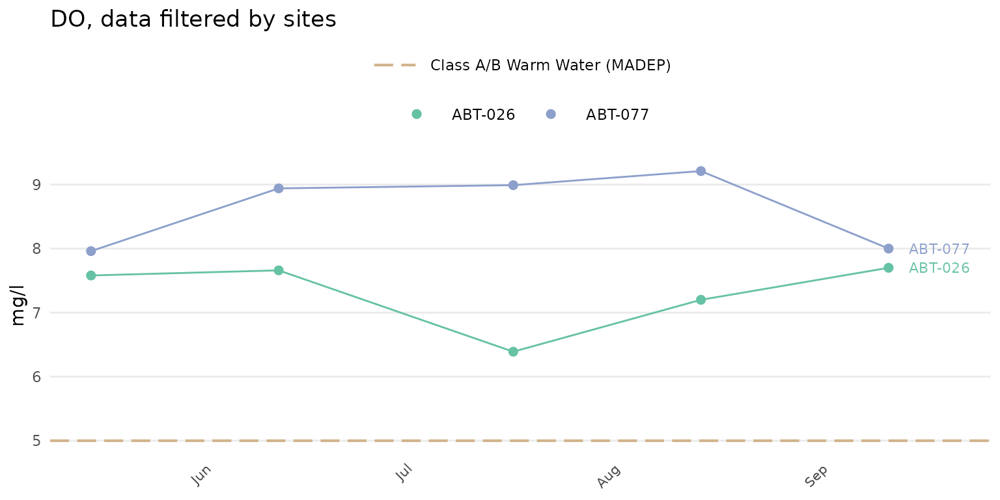

The color palette for the site points and lines can also be changed. Any
palette from
[RColorBrewer](https://r-graph-gallery.com/38-rcolorbrewers-palettes.html)
can be used. These could include any of the qualitative color palettes,
e.g., `"Set1"`, `"Set2"`, etc. The continuous and diverging palettes
will also work, but may return color scales for points and lines that
are difficult to distinguish. The `palcol` argument does not apply if
`group = "all"`. In the following example, the qualitative `"Set1"`
palette is used.

``` r
anlzMWRdate(res = resdat, param = "DO", acc = accdat, thresh = "fresh", group = "site", site = c("ABT-026", "ABT-077"), palcol = "Set1")
```

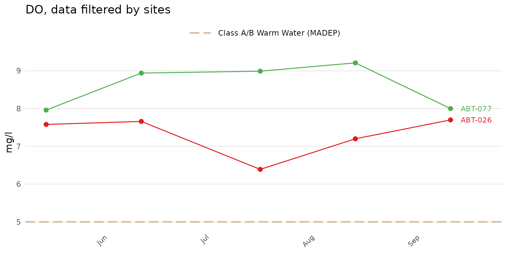

The results averaged across the selected sites can be plotted using
`group = "all"`. The point and line color defaults to black.

``` r
anlzMWRdate(res = resdat, param = "DO", acc = accdat, thresh = "fresh", group = "all", site = c("ABT-026", "ABT-077"))
```


The results averaged across all sites in the results file can be plotted
by omitting the `site` argument.

``` r
anlzMWRdate(res = resdat, param = "DO", acc = accdat, thresh = "fresh", group = "all")
```


Confidence intervals at 95% for the points can be shown when
`group = "all"` or `"locgroup"` by setting `confint = TRUE`.

``` r
anlzMWRdate(res = resdat, param = "DO", acc = accdat, thresh = "fresh", group = "all", confint = TRUE)
```


Sites can be summarized across location groups using
`group = "locgroup"`. This option requires the site metadata file passed
to the `sit` argument and appropriate values for the location groups
passed to the `locgroup` argument that match values in the
`Location Group` column of the site metadata file.

``` r
anlzMWRdate(res = resdat, param = 'DO', acc = accdat, sit = sitdat, group = 'locgroup', 
      thresh = 'fresh', locgroup = 'Assabet')
```


All location groups can be used if the `locgroup` argument is omitted.

``` r
anlzMWRdate(res = resdat, param = 'DO', acc = accdat, sit = sitdat, group = 'locgroup', 
      thresh = 'fresh')
```

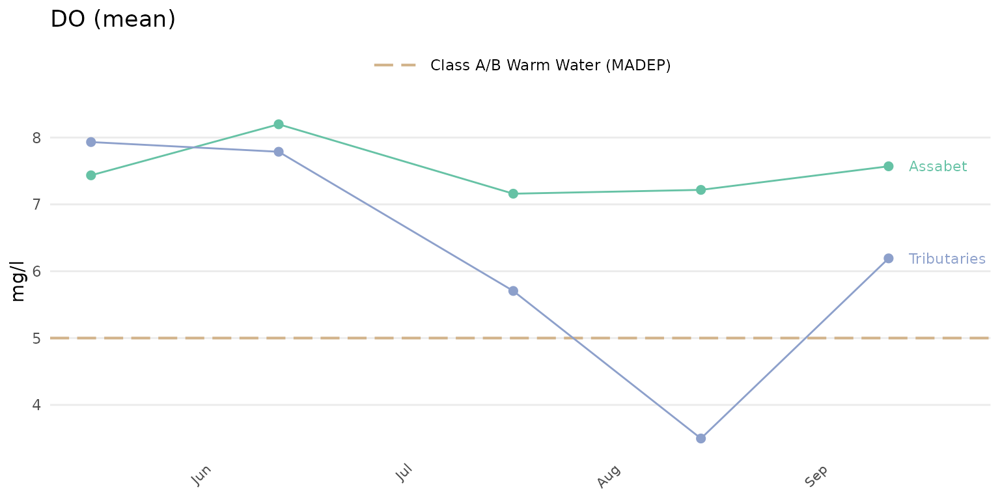

Alternative summaries can also be used if `group = "all"` or
`"locgroup"` by using an appropriate value for the `sumfun` argument. By
default, the `sumfun` argument is based on the value passed to `yscl`,
i.e., automatic summaries (`yscl = "auto"`) as mean or geometric mean
based on information in the data quality objective file for accuracy or
using mean or geometric regardless of the accuracy file
(`yscl = "linear"` or `yscl = "log"`). Using any appropriate value for
the `sumfun` argument will override any value used for the `yscl`
argument. Options for `sumfun` include `"auto"` (automatically as mean
or geometric mean using information in the data quality objective file
for accuracy), `"mean"`, `"geomean"`, `"median"`, `"min"`, or `"max"`.
Below, the median is used to summarize results by location group.

``` r
anlzMWRdate(res = resdat, param = 'DO', acc = accdat, sit = sitdat, group = 'locgroup', 
      thresh = 'fresh', sumfun = 'median')
```

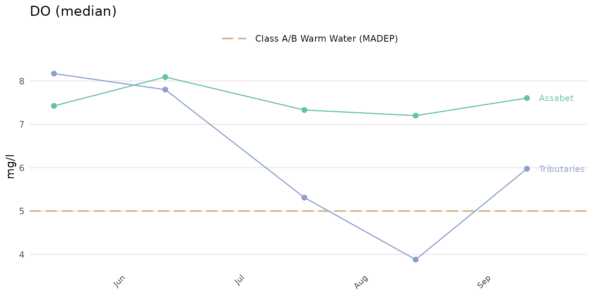

## Analyze data by site

Result data by site for selected parameters can be evaluated using the
[`anlzMWRsite()`](https://massbays-tech.github.io/MassWateR/reference/anlzMWRsite.md)
function. This function summarizes results for a single parameter using
boxplots or barplots separately for each site on the x-axis. Boxplots or
barplots can also include jittered points of the observations on top or
only the jittered points can be shown. Many of the options described for
the
[`anlzMWRseason()`](https://massbays-tech.github.io/MassWateR/reference/anlzMWRseason.md)
function also apply and will not be repeated here. As before, the
required data are a results file and data quality objective file for
accuracy. These can be passed to the function with the separate
arguments or as a named list using the `fset` argument.

The default plot for
[`anlzMWRsite()`](https://massbays-tech.github.io/MassWateR/reference/anlzMWRsite.md)
will show boxplots of results for each site and y-axis scaling
determined automatically from the data quality objectives file.

``` r
anlzMWRsite(res = resdat, param = "DO", acc = accdat, thresh = "fresh", type = "box")
```


Jittered points over the boxplots can be shown by setting
`type = "jitterbox"`.

``` r
anlzMWRsite(res = resdat, param = "DO", acc = accdat, thresh = "fresh", type = "jitterbox")
```


Results as barplots can be shown using `type = "bar"`.

``` r
anlzMWRsite(res = resdat, param = "DO", acc = accdat, thresh = "fresh", type = "bar")
```


Confidence intervals at 95% for the barplots can be shown by setting
`confint = TRUE`.

``` r
anlzMWRsite(res = resdat, param = "DO", acc = accdat, thresh = "fresh", type = "bar", confint = TRUE)
```

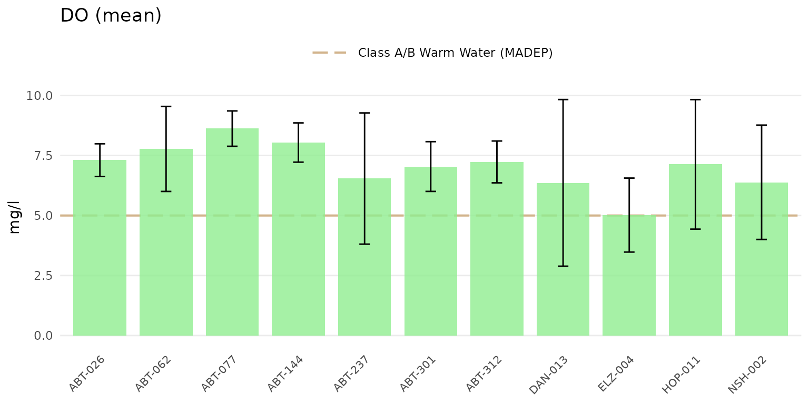

Jittered points over the barplots can be shown by setting
`type = "jitterbar"`.

``` r
anlzMWRsite(res = resdat, param = "DO", acc = accdat, thresh = "fresh", type = "jitterbar")
```


Setting `type = "jitter"` will show only the jittered points.

``` r
anlzMWRsite(res = resdat, param = "DO", acc = accdat, thresh = "fresh", type = "jitter")
```


If `type` is `"bar"` or `"jitterbar"`, the data will be summarized using
the mean or geometric mean as appropriate for the parameter based on
information in the data quality objective file for accuracy. By default,
the summary is based on the `yscl` argument. The default can be changed
by passing a value to the `sumfun` argument, where appropriate values
include `"auto"` (automatically as mean or geometric mean using
information in the data quality objective file for accuracy), `"mean"`,
`"geomean"`, `"median"`, `"min"`, or `"max"`. Below, the median summary
is shown.

``` r
anlzMWRsite(res = resdat, param = "DO", acc = accdat, thresh = "fresh", type = "jitterbar", 
            sumfun = 'median')
```


Results can be grouped by entries in the `Result Atribute` column using
`byresultatt = TRUE`. For example, sites with DO samples can be grouped
by `"DRY"` or `"WET"` conditions. Filtering by sites first using the
`site` argument is advised to reduce the amount of data that are
plotted. The grouping can be filtered further by passing appropriate
values in the `Result Attribute` column to the `resultatt` argument.
Note that specifying result attributes with `resultatt` and setting
`byresultatt = FALSE` will filter the plot data by the result attributes
but will not plot the results separately.

``` r
anlzMWRsite(res = resdat, param = "DO", acc = accdat, thresh = "fresh", type = "box", 
                        site = c("ABT-026", "ABT-062", "ABT-077", "ABT-144", "ABT-237", "ABT-301"),
                        resultatt = c('DRY', 'WET'), byresultatt = TRUE)
```

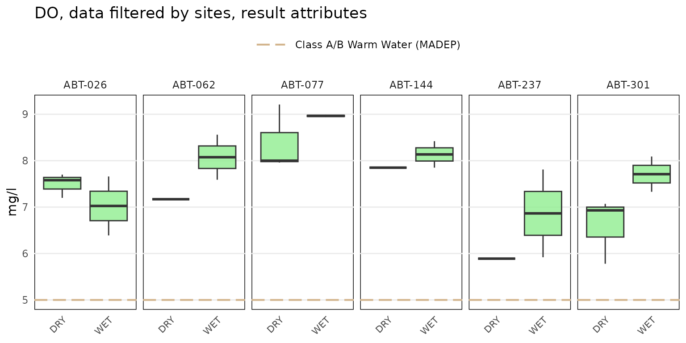

## Analyze results with maps

The
[`anlzMWRmap()`](https://massbays-tech.github.io/MassWateR/reference/anlzMWRmap.md)
function can be used to create a map of summarized results for a
selected parameter at each monitoring site. By default, all dates for
the parameter are summarized as the mean or geometric mean based on
information in the data quality objective file for accuracy. Options to
filter by site, date range, and result attribute are provided. Only
sites with spatial information in the site metadata file are plotted and
a warning is returned for those that do not have this information. The
site labels are also plotted next to each point.

A map of dissolved oxygen averages across all dates can be created as
follows. The required inputs are the results data, the data quality
objective file for accuracy, and the site metadata file with the site
locations. These can be passed to the function with the separate
arguments or as a named list using the `fset` argument.

``` r
anlzMWRmap(res = resdat, param = "DO", acc = accdat, sit = sitdat, addwater = "medium")
```

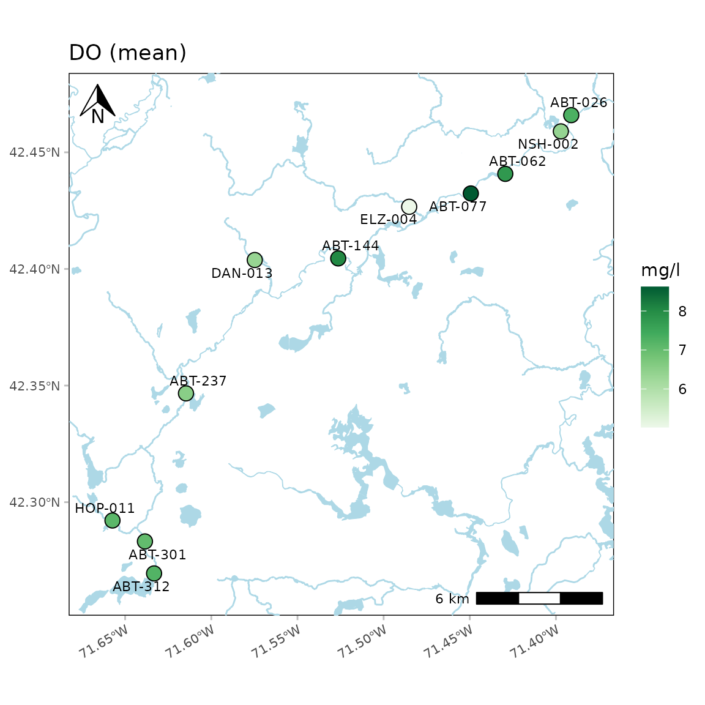

The results shown on the map represent the parameter summary for each
site across the sample dates. If `sumfun = "auto"` (default), the mean
is used where the distribution is determined automatically from the data
quality objective file for accuracy, i.e., parameters with “log” in any
of the columns are summarized with the geometric mean, otherwise
arithmetic. Any other valid summary function will be applied if passed
to `sumfun` (`"mean"`, `"geomean"`, `"median"`, `"min"`, `"max"`),
regardless of the information in the data quality objective file for
accuracy. Below, the minimum dissolved oxygen is shown. The color
palette is also reversed.

``` r
anlzMWRmap(res = resdat, param = "DO", acc = accdat, sit = sitdat, addwater = "medium", 
           sumfun = "min", palcolrev = TRUE)
```


By default, lines and polygons of natural water bodies defined using the
National Hydrography Dataset (NHD) are plotted. Using
`addwater = "medium"` (default) will plot water bodies at medium detail.
The level of detail can be changed to low or high using
`addwater = "low"` or `addwater = "high"`, respectively. Use
`addwater = NULL` to not show any water features.

Water body detail as low:

``` r
anlzMWRmap(res = resdat, param = "DO", acc = accdat, sit = sitdat, addwater = "low", warn = F)
```

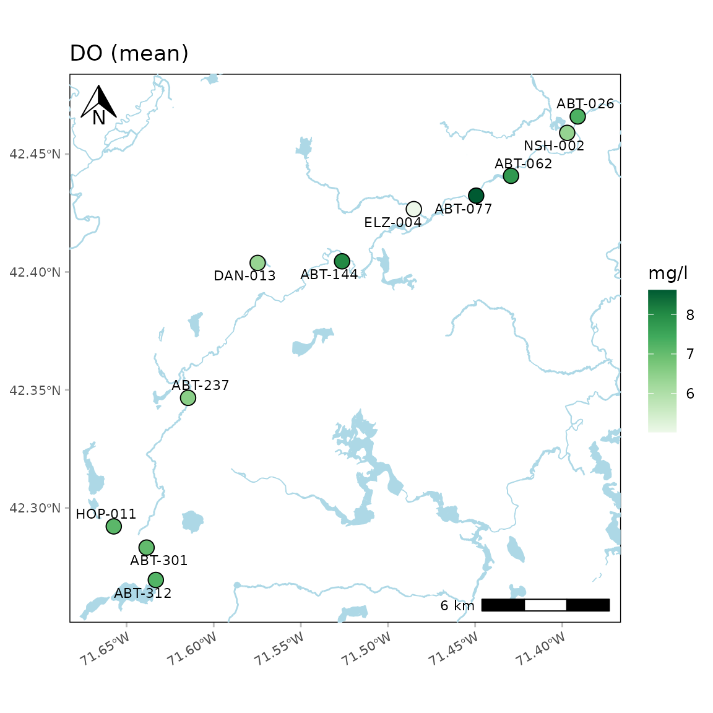

Water body detail as high:

``` r
anlzMWRmap(res = resdat, param = "DO", acc = accdat, sit = sitdat, addwater = "high", warn = F)
```


A north arrow, scale bar, and labels are also plotted. These can be
suppressed by setting the appropriate arguments to `NULL`.

``` r
anlzMWRmap(res = resdat, param = "DO", acc = accdat, sit = sitdat, northloc = NULL, scaleloc = NULL, labsize = NULL, warn = F)
```

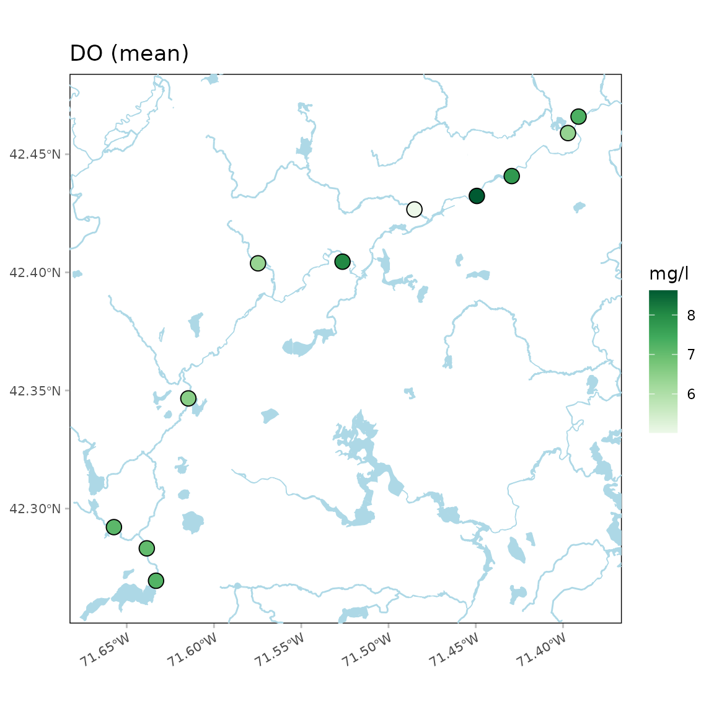

Locations of the north arrow and scale bar can be changed with the same
arguments by specifying `"tl"`, `"tr"`, `"bl"`, or `"br"` for top-left,
top-right, bottom-left, or bottom-right.

``` r
anlzMWRmap(res = resdat, param = "DO", acc = accdat, sit = sitdat, northloc = "br", scaleloc = "tl", warn = F)
```

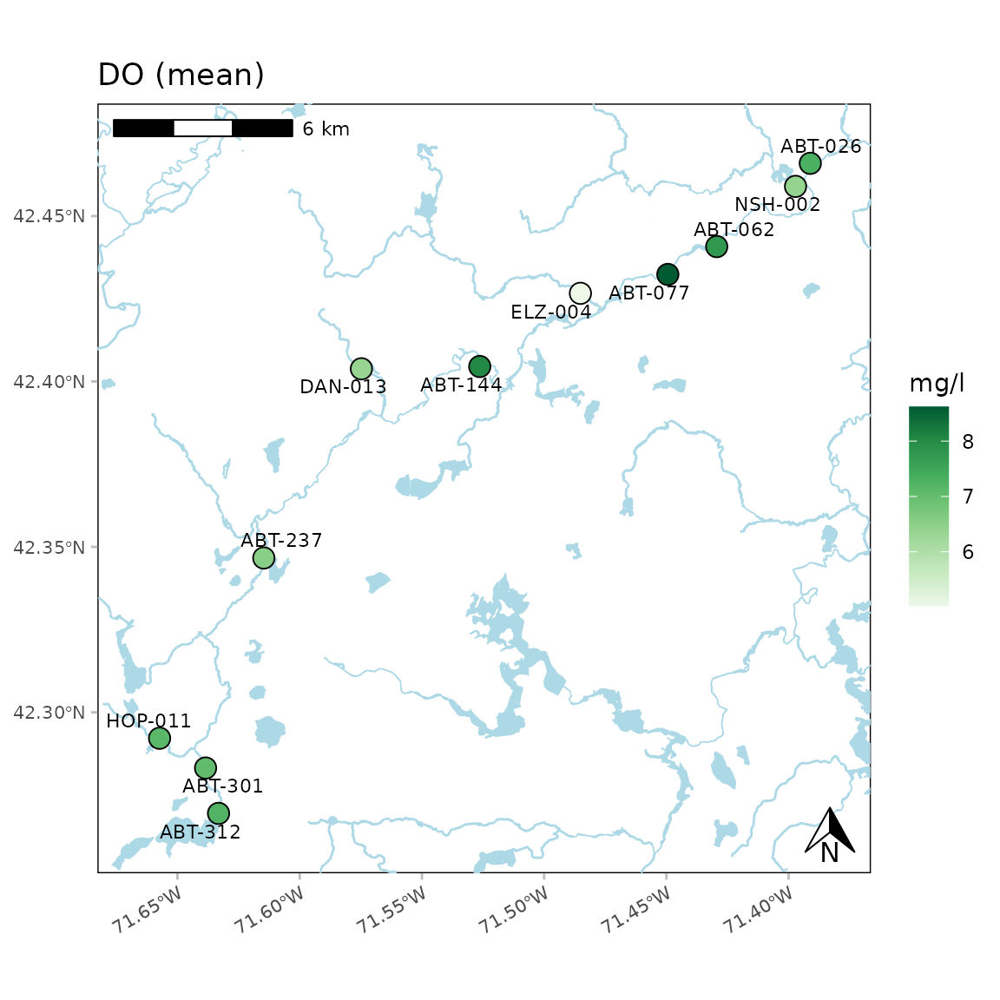

The latitude and longitude text on the plot axes can be suppressed using
`latlon = FALSE`.

``` r
anlzMWRmap(res = resdat, param = "DO", acc = accdat, sit = sitdat, latlon = F, warn = F)
```

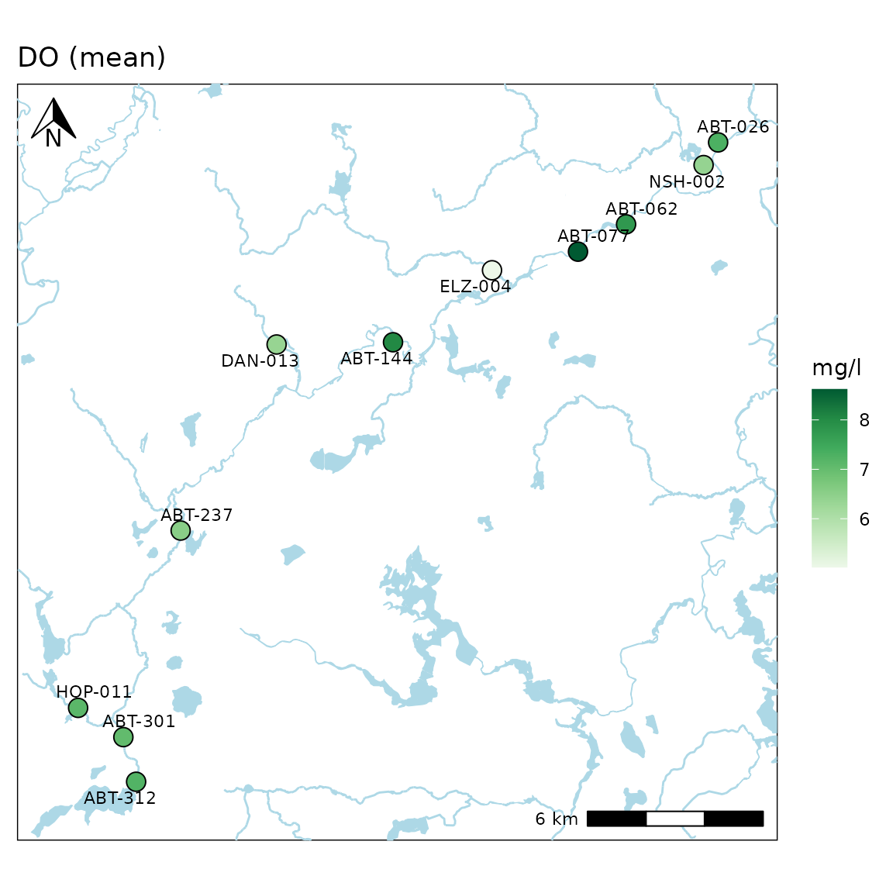

The color palette for the average values can also be changed. Any
palette from
[RColorBrewer](https://r-graph-gallery.com/38-rcolorbrewers-palettes.html)
can be used. These could include any of the sequential color palettes,
e.g., `"Greens"`, `"Blues"`, etc. The diverging and qualitative palettes
will also work, but may return uninterpretable color scales. In the
following example, the diverging `"Spectral"` palette is used.

``` r
anlzMWRmap(res = resdat, param = "DO", acc = accdat, sit = sitdat, palcol = "Spectral", warn = F)
```

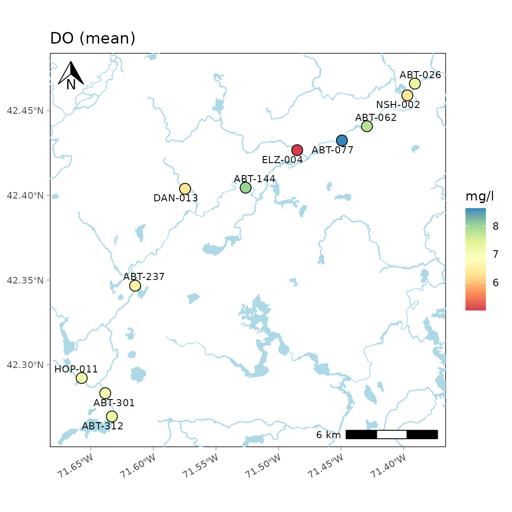

The buffered distance around the points can be increased using the
`buffdist` argument (in kilometers).

``` r
anlzMWRmap(res = resdat, param = "DO", acc = accdat, sit = sitdat, buffdist = 20, warn = F)
```

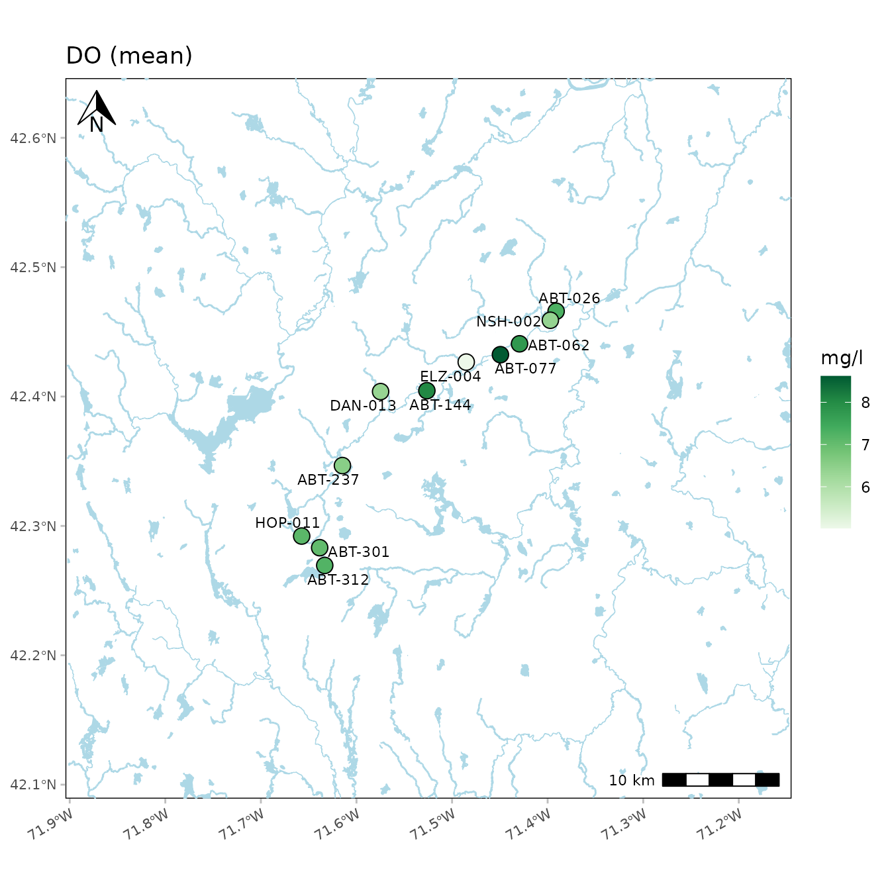

A base map can be included as well using the `maptype` argument. Options
include `"OpenStreetMap"`, `"OpenStreetMap.DE"`,
`"OpenStreetMap.France"`, `"OpenStreetMap.HOT"`, `"OpenTopoMap"`,
`"Esri.WorldStreetMap"`, `"Esri.DeLorme"`, `"Esri.WorldTopoMap"`,
`"Esri.WorldImagery"`, `"Esri.WorldTerrain"`,
`"Esri.WorldShadedRelief"`, `"Esri.OceanBasemap"`,
`"Esri.NatGeoWorldMap"`, `"Esri.WorldGrayCanvas"`, `"CartoDB.Positron"`,
`"CartoDB.PositronNoLabels"`, `"CartoDB.PositronOnlyLabels"`,
`"CartoDB.DarkMatter"`, `"CartoDB.DarkMatterNoLabels"`,
`"CartoDB.DarkMatterOnlyLabels"`, `"CartoDB.Voyager"`,
`"CartoDB.VoyagerNoLabels"`, or `"CartoDB.VoyagerOnlyLabels"`. The
`zoom` argument can be helpful when using a basemap. The default `zoom`
argument is set to 11 and decreasing the number will download a base map
with lower resolution. This can decrease map processing times for large
areas.

A `"CartoDB.Positron"` base map:

``` r
anlzMWRmap(res = resdat, param = "DO", acc = accdat, sit = sitdat, maptype = "CartoDB.Positron", warn = F, addwater = NULL)
```


A `"Esri.WorldImagery"` base map:

``` r
anlzMWRmap(res = resdat, param = "DO", acc = accdat, sit = sitdat, maptype = "Esri.WorldImagery", warn = F, addwater = NULL)
```

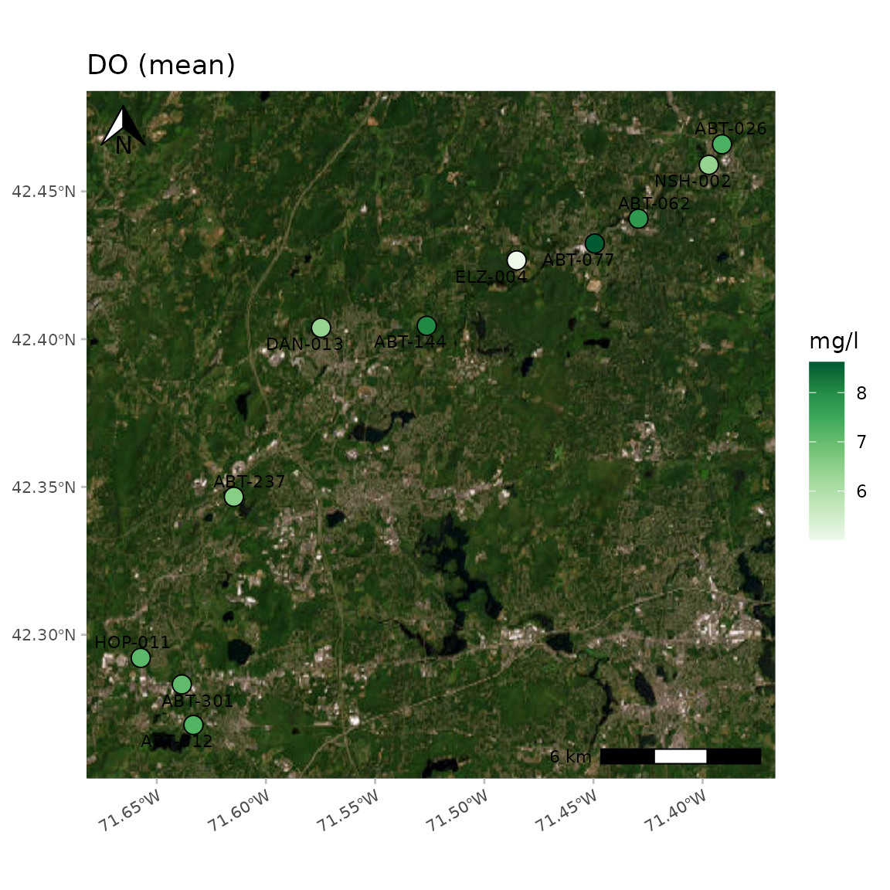

A map with no base map or water bodies:

``` r
anlzMWRmap(res = resdat, param = "DO", acc = accdat, sit = sitdat, maptype = NULL, warn = F, addwater = NULL)
```

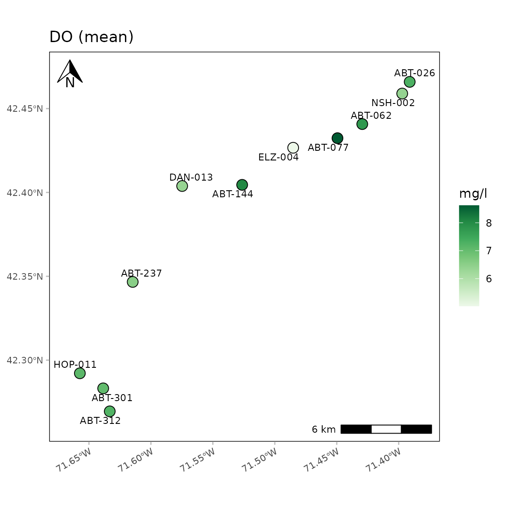
