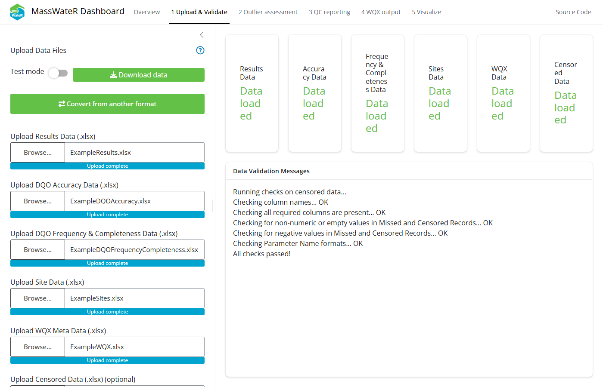
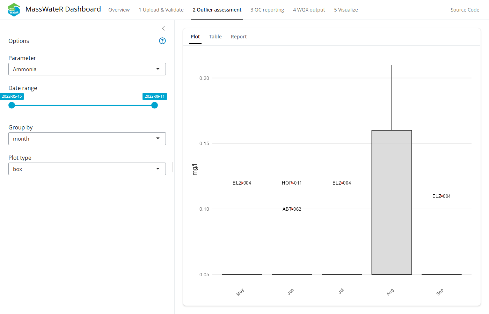
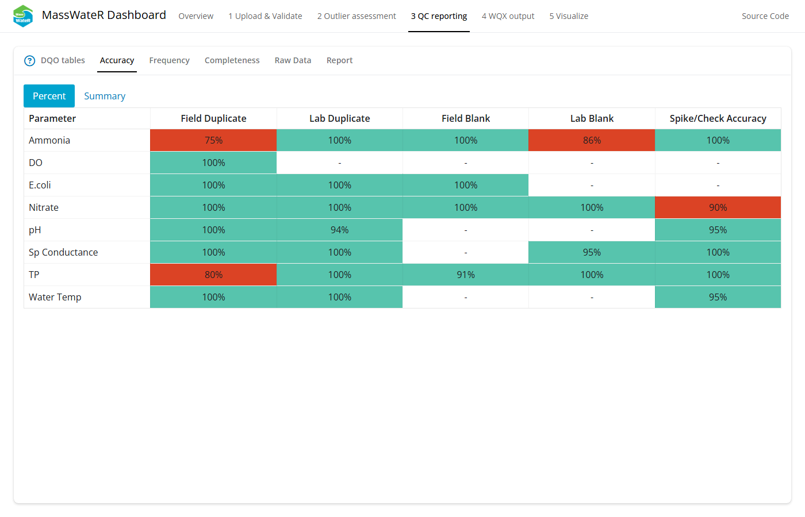
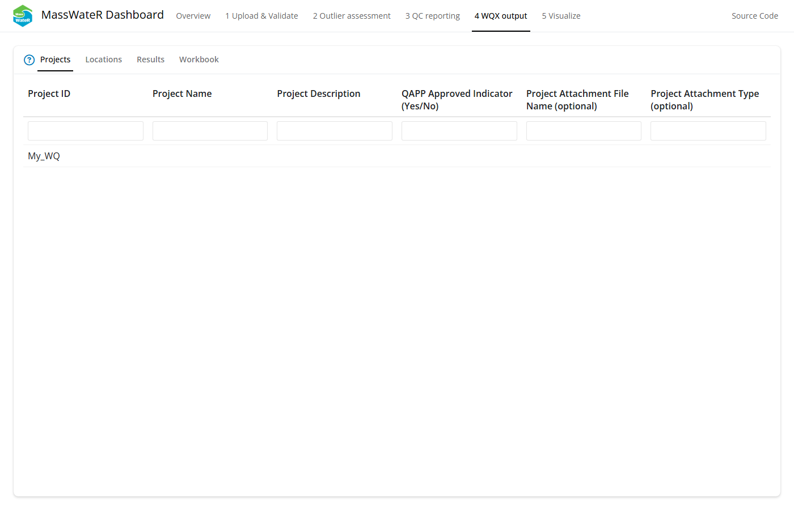
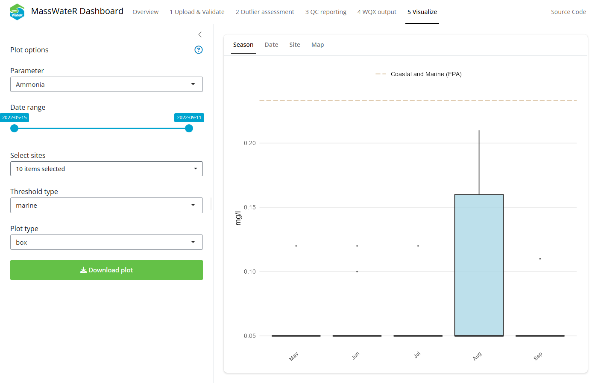

# MassWateR Dashboard

## Overview

A Shiny dashboard is available to use the MassWateR workflow entirely
within a web browser. The dashboard walks through the same steps
described elsewhere in the vignette articles without requiring any R
code. This includes uploading and validating your data files, reviewing
potential outliers, assessing data quality objectives and creating
quality control reports, preparing output for the Water Quality Exchange
(WQX), and visualizing your results.

## Accessing the dashboard

The dashboard can be accessed two ways.

### Install as an R package

The dashboard is available as a companion R package,
[MassWateRdash](https://github.com/massbays-tech/MassWateRdash). Issues
directly related to the dashboard and its use can be reported on that
repository’s [issues
page](https://github.com/massbays-tech/MassWateRdash/issues) (issues
related to core features of the MassWateR package can be reported on the
[MassWateR issues
page](https://github.com/massbays-tech/MassWateR/issues)).

Install the MassWateRdash repository directly from GitHub and launch it
from an R session:

``` r

remotes::install_github("massbays-tech/MassWateRdash")
library(MassWateRdash)
run_app()
```

This opens the dashboard in your default web browser. Data are uploaded
from your computer and all processing happens locally in your R session.

### Use the dashboard from a web browser

A hosted instance of the dashboard is also available directly in a
browser:

    http://<server-ip>:3838/

## Using the dashboard

The dashboard includes five pages, accessible from the navigation bar at
the top of the app. Each page includes a help button (a question mark
icon) that opens a popup describing what the page shows and how to use
it. The Outlier Assessment, QC Reporting, WQX Output, and Visualize
pages become available in the navigation bar once data have been
uploaded and validated on the Upload & Validate page.

### 1. Upload & Validate

This page is used to upload and format data used for the rest of the
dashboard. Five types of data (six files) are used with the MassWateR
package, described in the [Data input and
checks](https://massbays-tech.github.io/MassWateR/articles/inputs.md)
article.

1.  Water quality **results** organized by sample location and date.
2.  Summary of data quality objectives that describe quality control
    **accuracy**, **frequency**, and **completeness** measures for data
    in the results file. These are separate files, one for accuracy and
    frequency and another for completeness.
3.  A **site metadata** file, including location names, latitude,
    longitude, and additional grouping factors for sites.
4.  A **WQX metadata** file required for generating output to facilitate
    data upload to WQX.
5.  Optional information on the number of **censored** or missing
    observations by parameter, used only in the quality control report.

The dashboard can be run in **test mode** by flipping the switch in the
top left. This loads pre-existing files to use with the package.

Choosing the option to **convert from another format** opens up a box to
convert existing data into the format required by MassWateR. This option
makes use of the [wqformat](https://github.com/massbays-tech/wqformat)
package.

Uploading data files will run the standard suite of checks used by
MassWateR that ensure the data are the correct format. Templates are
available on the package’s
[Resources](https://massbays-tech.github.io/MassWateR/RESOURCES.html)
page. An interactive popup will appear if the data require correction.
Follow the on-screen prompts to correct the data, then click “Try upload
again” to load the corrected data from within the app.

Input data can be downloaded in a zipped folder once uploaded by
clicking the **Download data** button. The button is only visible after
data are uploaded.



The Upload & Validate tab.

### 2. Outlier Assessment

This page is used to view potential outliers in the results data file,
described in more detail in the [Outlier
checks](https://massbays-tech.github.io/MassWateR/articles/outlierchecks.md)
article.

The controls on the left sidebar can be used to select the parameter,
date range, grouping factor, and plot type. The latter two are for the
plots shown in the plot sub-tab.

The right side shows the outliers for the selected options. Cycle
through the sub-tabs to view the results as a **plot** or displayed
separately in a **table**. The third **report** sub-tab can be used to
download a complete outlier report. The report can be downloaded as a
Word file with all plots included or as a zipped file with images for
all plots.



The Outlier Assessment tab.

### 3. QC Reporting

This page is used to view the quality control information for the
results data file, using information from the data quality objectives
that describe quality control accuracy, frequency, and completeness. See
the [Quality
control](https://massbays-tech.github.io/MassWateR/articles/qcoverview.md)
article for detailed information on the quality control methods and
results.

The page includes six sub-tabs:

1.  **DQO tables**: View tables for the **frequency & completeness** and
    **accuracy** data quality objectives. These are the same files
    imported on the first page.
2.  **Accuracy**: The quality control checks for accuracy assess several
    characteristics of the data in the results file by referencing
    appropriate values in the data quality objectives file for accuracy.
    In short, the accuracy checks evaluate field blanks, lab blanks,
    field duplicates, lab duplicates, lab spikes, and instrument checks.
    View a table showing the **percent** of observations by parameter
    that fulfill data quality objectives for accuracy. A **summary**
    table showing all results by parameter and quality control check can
    also be viewed.
3.  **Frequency**: The quality control checks for frequency are used to
    verify an appropriate number of quality control samples have been
    collected or analyzed for each parameter. These are checks on the
    quantity of samples and not the values, as for the accuracy checks.
    View a table showing the **percent** of observations by parameter
    that fulfill data quality objectives for frequency. A **summary**
    table showing all results by parameter and quality control check can
    also be viewed.
4.  **Completeness**: The quality control checks for completeness are
    used to assess the number of regular samples relative to qualified
    samples that apply to each parameter. A single table shows the
    outcome of these checks.
5.  **Raw Data**: Individual quality control checks for every parameter
    and observation can be viewed on this sub-tab. Results can be viewed
    for **field duplicates**, **lab duplicates**, **field blanks**,
    **lab blanks**, and **lab spikes / instrument checks**.
6.  **Report**: Download a complete quality control report as a Word
    document. This report includes all tables in this page.



The QC Reporting tab.

### 4. WQX Output

This page is used to view your data formatted for upload to the Water
Quality Exchange (WQX) portal. See the [Water Quality Exchange
output](https://massbays-tech.github.io/MassWateR/articles/wqx.md)
article for detailed information on the results and how to upload to
WQX.

The page includes four sub-tabs:

1.  **Projects**: View a table showing project information from your
    results file formatted for WQX upload.
2.  **Locations**: View a table showing site locations from your results
    and site files formatted for WQX upload.
3.  **Results**: View a complete water quality file formatted for WQX
    upload.
4.  **Workbook**: Download a complete WQX Excel workbook. This file
    includes all tables in this page.

The output is populated with as much content as possible based on
information in the input files. The remainder of the information not
included in the output will need to be manually entered before uploading
the data to WQX. All required columns are present, but individual rows
will need to be verified for completeness. It is the responsibility of
the user to verify this information is complete and correct before
uploading the data.



The WQX Output tab.

### 5. Visualize

This page is used to visualize results from your input data files. See
the
[Analyses](https://massbays-tech.github.io/MassWateR/articles/analysis.md)
article for detailed information on the plots and methods used to create
them.

The controls on the left sidebar can be used to select the parameter,
date range, sites, threshold type (as a line on the plot), and plot type
(e.g., boxplot, barplot, etc.). These options will change based on the
selected sub-tab on the right. A download button can be used to download
an image of the visible plot.

Four types of plots can be viewed with the right sub-tabs:

1.  **Season**: View monthly results for a single parameter using
    boxplots or barplots.
2.  **Date**: View results continuously over time for a single parameter
    as line plots, with the lines separated by site.
3.  **Site**: View results for a single parameter using boxplots or
    barplots separately for each site on the x-axis.
4.  **Map**: View a map of summarized results for a selected parameter
    at each monitoring site. Results are summarized as the mean or
    geometric mean based on information in the data quality objective
    file for accuracy. Additional options for the map can be used to
    change the complexity of the water features and type of basemap.



The Visualize tab.
