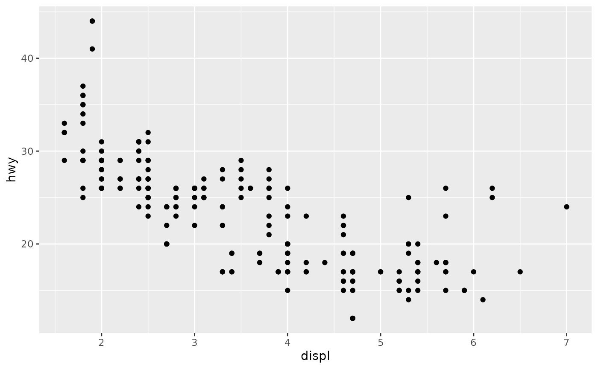
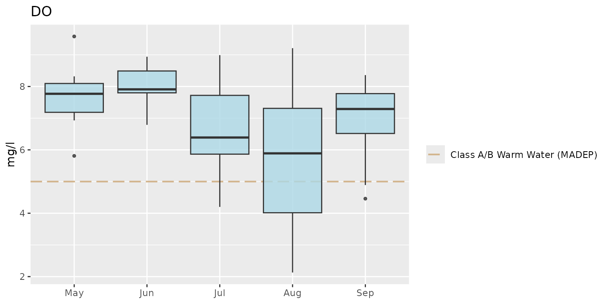
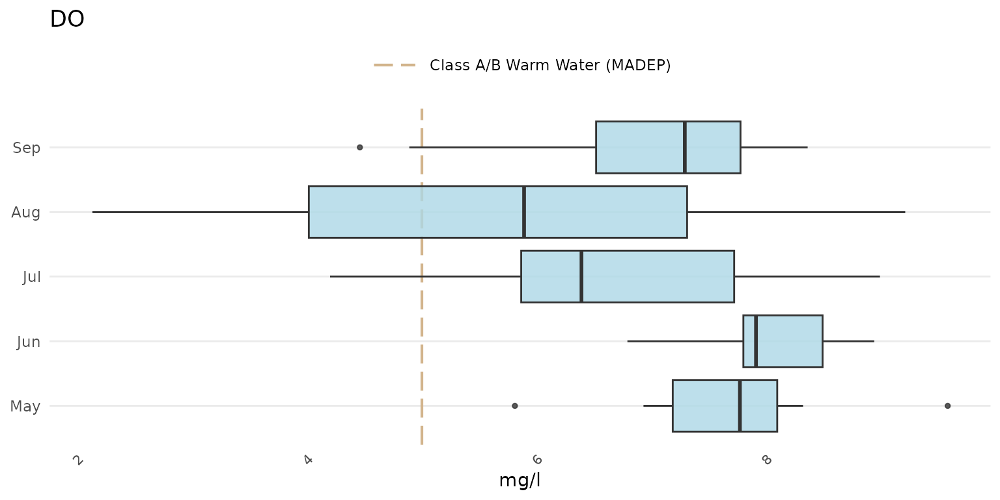

# Modifying plots

The default format for plots created from any of the
[analyze](https://massbays-tech.github.io/MassWateR/articles/analysis.html)
functions, including the [outlier
plots](https://massbays-tech.github.io/MassWateR/articles/outlierchecks.html),
should be sufficient in most cases. However, the plot outputs are
[`ggplot()`](https://ggplot2.tidyverse.org/reference/ggplot.html)
objects and can be modified using common
[`ggplot()`](https://ggplot2.tidyverse.org/reference/ggplot.html) plot
functions (see the [ggplot2](https://ggplot2.tidyverse.org/index.html)
page for details). A brief overview of ggplot2 is provided here as
context to the MassWateR plot modifications below.

## ggplot2

The ggplot2 package was developed following a strict philosophy known as
the grammar of graphics. This philosophy was designed to make thinking,
reasoning, and communicating about graphs easier by following a few
simple rules.

First, ggplot2 is loaded.

``` r
library(ggplot2)
```

A plot can be created with the function
[`ggplot()`](https://ggplot2.tidyverse.org/reference/ggplot.html). This
creates an empty coordinate system for adding layers. The first argument
of [`ggplot()`](https://ggplot2.tidyverse.org/reference/ggplot.html) is
the dataset to use in the graph. The following creates an empty base
graph for the `mpg` dataset included with ggplot2.

``` r
ggplot(data = mpg)
```

The next step is to add one or more layers (aka `geoms`) to the
[`ggplot()`](https://ggplot2.tidyverse.org/reference/ggplot.html)
function. The function
[`geom_point()`](https://ggplot2.tidyverse.org/reference/geom_point.html)
adds a layer of points to the plot. The ggplot2 package includes many
geom functions that each add a different type of layer to a plot. Note
the use of the `+` syntax to build the plot - this is a distinct style
of coding that is only used with ggplot2.

``` r
ggplot(data = mpg) +
  geom_point()
```

Each geom function in ggplot2 requires a `mapping` argument. This
defines how variables in a dataset are mapped to visual properties. The
`mapping` argument is defined with
[`aes()`](https://ggplot2.tidyverse.org/reference/aes.html), and the `x`
and `y` arguments of
[`aes()`](https://ggplot2.tidyverse.org/reference/aes.html) specify
which variables to map to the x and y axes. The
[`ggplot()`](https://ggplot2.tidyverse.org/reference/ggplot.html)
function looks for the mapped variable in the `data` argument, in this
case, `mpg`.

``` r
ggplot(data = mpg, mapping = aes(x = displ, y = hwy)) +
  geom_point()
```



Every ggplot follows these rules:

- Each plot starts with the
  [`ggplot()`](https://ggplot2.tidyverse.org/reference/ggplot.html)
  function
- Each plot needs three pieces of information: the data, how the data
  are mapped to the plot aesthetics, and a geom layer

Please visit the [ggplot2](https://ggplot2.tidyverse.org/index.html)
website for more information.

## Modifying MassWateR plots

For plots in MassWateR, additional components can be added using the `+`
notation as for a standard
[`ggplot()`](https://ggplot2.tidyverse.org/reference/ggplot.html)
object. This is distinct from using any of the default arguments for the
plots to change the appearance (e.g., `fill = "red"`). Overriding some
of the existing plot components may also significantly alter the
appearance, so use caution. Also note that adding ggplot2 components to
an existing MassWateR plot may or may not work based on how the plot is
setup. For higher levels of customization, we recommend creating a
custom ggplot from scratch, using data from the results file that you
loaded for MassWateR. To prepare the results file for use, you can use
the
[utilMWRlimits()](https://massbays-tech.github.io/MassWateR/articles/utility.html#fill-data-outside-of-detection-or-quantitation-limit)
function to populate values outside detection limits and remove QC rows.

Before we can modify any plots, the required input files for the
MassWateR analyze functions are imported, using the files included with
the package for the examples. The checks and warnings are suppressed
because we know the files are formatted correctly.

``` r
library(MassWateR)

# import results data
respth <- system.file("extdata/ExampleResults.xlsx", package = "MassWateR")
resdat <- readMWRresults(respth, runchk = F, warn = F)

# import accuracy data
accpth <- system.file("extdata/ExampleDQOAccuracy.xlsx", package = "MassWateR")
accdat <- readMWRacc(accpth, runchk = F)

# import site metadata
sitpth <- system.file("extdata/ExampleSites.xlsx", package = "MassWateR")
sitdat <- readMWRsites(sitpth, runchk = F)

fsetls <- list(res=resdat, acc=accdat, sit=sitdat)
```

Below are a few examples of additions to change the standard plot, using
[`anlzMWRseason()`](https://massbays-tech.github.io/MassWateR/reference/anlzMWRseason.md)
for demonstration. A single plot object for the original plot is created
as `p` and is modified differently in each example.

``` r
p <- anlzMWRseason(fset = fsetls, param = "DO", thresh = "fresh", group = "month")
```

Modify plot labels:

``` r
p +
  labs(
    x = "Month", 
    y = "Dissolved oxygen (mg/L)", 
    title = "Seasonal summaries for dissolved oxygen"
  )
```


Modify the theme:

``` r
p + theme_grey()
```



Notice how the default legend placement and x-axis text were altered by
changing the theme. These can be changed by combining a preset theme
(e.g.,
[`theme_bw()`](https://ggplot2.tidyverse.org/reference/ggtheme.html))
with additional
[`theme()`](https://ggplot2.tidyverse.org/reference/theme.html)
elements.

``` r
p + 
  theme_bw() +
  theme(
    axis.text = element_text(size = 14), 
    legend.position = "bottom"
  )
```


The axis limits can be changed using
[`coord_cartesian()`](https://ggplot2.tidyverse.org/reference/coord_cartesian.html).
Changing the y-axis requires only the numeric range using the `ylim`
argument.

``` r
p + coord_cartesian(ylim = c(0, 8))
```


A plot with facets for each site:

``` r
p + facet_wrap(~`Monitoring Location ID`)
```


Switch the axes:

``` r
p + coord_flip()
```



Add a custom reference line (although the `thresh` argument can also be
used with a numeric value):

``` r
p +
  geom_hline(yintercept = 10, linetype = 'solid', color = 'green', linewidth = 2)
```


Additional layers can also be added to maps created with
[`anlzMWRmap()`](https://massbays-tech.github.io/MassWateR/reference/anlzMWRmap.md).
For example, a watershed shapefile can be imported as a simple features
object using the [sf](https://r-spatial.github.io/sf/) package, then
added using
[`geom_sf()`](https://ggplot2.tidyverse.org/reference/ggsf.html) from
ggplot. Any warnings about the coordinate system can be ignored.
Depending on the watershed boundaries, it may be necessary to adjust the
extent of the water features (with `buffdist`) and/or the boundaries of
the map box (with
[`coord_sf()`](https://ggplot2.tidyverse.org/reference/ggsf.html)).

``` r
library(sf)
library(ggplot2)

# import shapefile as sf object
sudburyMWR <- st_read(dsn='C:/Documents/MapLayers', layer='sudburyMWR')

# use geom_sf to add watershed
anlzMWRmap(fset = fsetls, param = 'DO', addwater = 'high', buffdist = 3) + 
  geom_sf(data = sudburyMWR) +
  coord_sf(xlim = c(-71.68, -71.31), ylim = c(42.20, 42.48))
```


Sometimes you might want to place two plots side by side in the same
plot window. The [patchwork](https://patchwork.data-imaginist.com/)
package allows you to easily do this with ggplot. Two or more plots are
first created and then combined using the `+` syntax followed by the
plot layout (e.g., plots in two columns using `ncol = 2`).

``` r
library(patchwork)

p1 <- anlzMWRseason(fset = fsetls, param = "DO", thresh = "fresh", group = "month")
p2 <- anlzMWRseason(fset = fsetls, param = "pH", thresh = "fresh", group = "month")

p1 + p2 + plot_layout(ncol = 2)
```


