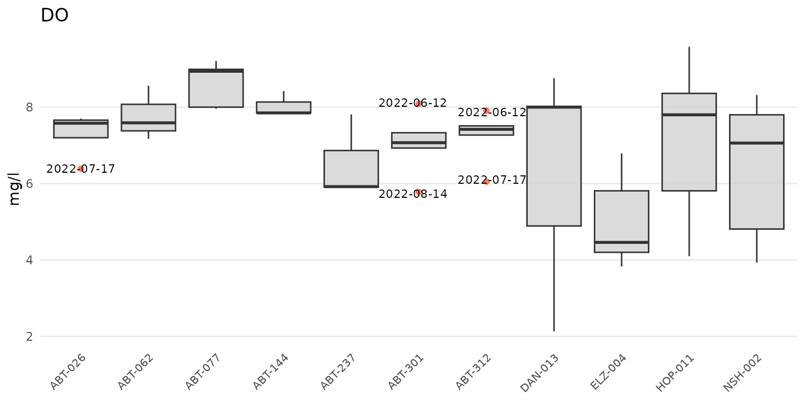

# MassWateR outlier checks

Outliers can be evaluated once the required data are successfully
imported into R (see the [data input and checks
vignette](https://massbays-tech.github.io/MassWateR/articles/inputs.html)
for an overview). The results data file with the monitoring data is
required. The data quality objectives file for accuracy is also required
to determine plot axis scaling as arithmetic (linear) or logarithmic and
to fill results data that are below detection or above quantitation
limits. The example data included with the package are imported here to
demonstrate how to use the analysis functions:

``` r
library(MassWateR)

# import results data
respth <- system.file("extdata/ExampleResults.xlsx", package = "MassWateR")
resdat <- readMWRresults(respth)
#> Running checks on results data...
#>  Checking column names... OK
#>  Checking all required columns are present... OK
#>  Checking valid Activity Types... OK
#>  Checking Activity Start Date formats... OK
#>  Checking depth data present... OK
#>  Checking for non-numeric values in Activity Depth/Height Measure... OK
#>  Checking Activity Depth/Height Unit... OK
#>  Checking Activity Relative Depth Name formats... OK
#>  Checking values in Activity Depth/Height Measure > 1 m / 3.3 ft... OK
#>  Checking Characteristic Name formats... OK
#>  Checking Result Values... OK
#>  Checking for non-numeric values in Quantitation Limit... OK
#>  Checking QC Reference Values... OK
#>  Checking for missing entries for Result Unit... OK
#>  Checking if more than one unit per Characteristic Name... OK
#>  Checking acceptable units for each entry in Characteristic Name... OK
#> 
#> All checks passed!

# import accuracy data
accpth <- system.file("extdata/ExampleDQOAccuracy.xlsx", package = "MassWateR")
accdat <- readMWRacc(accpth)
#> Running checks on data quality objectives for accuracy...
#>  Checking column names... OK
#>  Checking all required columns are present... OK
#>  Checking column types... OK
#>  Checking no "na" in Value Range... OK
#>  Checking for text other than <=, ≤, <, >=, ≥, >, ±, %, AQL, BQL, log, or all... OK
#>  Checking overlaps in Value Range... OK
#>  Checking gaps in Value Range... OK
#>  Checking Parameter formats... OK
#>  Checking for missing entries for unit (uom)... OK
#>  Checking if more than one unit (uom) per Parameter... OK
#>  Checking acceptable units (uom) for each entry in Parameter... OK
#>  Checking empty columns... OK
#> 
#> All checks passed!
```

## Analyzing outliers

Outliers can be identified using the
[`anlzMWRoutlier()`](https://massbays-tech.github.io/MassWateR/reference/anlzMWRoutlier.md)
function. Evaluating data for outliers is a critical step of quality
control, and this function allows a user to quickly identify them for
removal or additional follow-up. Outliers are defined using the standard
definition of 1.5 times the interquartile range (the 25th to 75th
percentile) of a parameter, depending on the grouping used for the
function. They are visually identified as points above or below the
whiskers in the boxplots that describe distribution of the data, i.e.,
the box defines the interquartile range, the horizontal line is the
median, and the whiskers extend above and below 1.5 times the
interquartile range.


A summary of the distribution statistics shown with a standard boxplot.
Outliers extend beyond the whiskers and are 1.5 times the interquartile
range.

The
[`anlzMWRoutlier()`](https://massbays-tech.github.io/MassWateR/reference/anlzMWRoutlier.md)
function uses the results data as a file path or data frame as input.
The data quality objectives for accuracy is also required. The input
files are passed to the function using the `res` and `acc` arguments,
but a named list with the same arguments can also be used with the
`fset` argument for convenience. The results for a selected parameter
are shown as boxplots, with the outliers labelled accordingly.

``` r
anlzMWRoutlier(res = resdat, param = "DO", acc = accdat, group = "month")
```


Outliers can be shown by month using `group = "month"`, by site using
`group = "site"`, or by week of year using `group = "week"`. Above,
outliers are shown for dissolved oxygen grouped by month. The same data
can also grouped by site.

``` r
anlzMWRoutlier(res = resdat, param = "DO", acc = accdat, group = "site")
```



The same data can also be grouped by week using `group = "week"`. The
week of the year is shown on the plot as an integer. Note that there can
be no common month/day indicating the start of the week between years
and an integer is the only way to compare summaries if the results data
span multiple years.

``` r
anlzMWRoutlier(res = resdat, param = "DO", acc = accdat, group = "week")
```


Results can also be filtered by dates using the `dtrng` argument. The
date format must be `YYYY-MM-DD` and include two entries.

``` r
anlzMWRoutlier(res = resdat, param = "DO", acc = accdat, group = "week", dtrng = c("2022-05-01", "2022-07-31"))
```


Points that are not outliers can also be jittered over the boxplots
using `type = "jitterbox"` (default is `type = "box"`). Outlier labels
that overlap are also offset by default. This can be suppressed using
`repel = FALSE`.

``` r
anlzMWRoutlier(res = resdat, param = "DO", acc = accdat, type = "jitterbox", group = "month", repel = FALSE)
```


Specifying `type = "jitter` will suppress the boxplots.

``` r
anlzMWRoutlier(res = resdat, param = "DO", acc = accdat, type = "jitter", group = "month")
```


The y-axis scaling as arithmetic (linear) or logarithmic can be set with
the `yscl` argument. If `yscl = "auto"` (default), the scaling is
determined automatically from the data quality objective file for
accuracy, i.e., parameters with “log” in any of the columns are plotted
on log10-scale, otherwise arithmetic. Setting `yscl = "linear"` or
`yscl = "log"` will set the axis as linear or log10-scale, respectively,
regardless of the information in the data quality objective file for
accuracy. Below, the axis for E. Coli is plotted on the log-10 scale
automatically. The y-axis scaling does not need to specified explicitly
in the function call because the default setting is `yscl = "auto"`.

``` r
anlzMWRoutlier(res = resdat, param = "E.coli", acc = accdat, group = "site")
```


To force the y-axis as linear for E. Coli, `yscl = "linear"` must be
used. Note that the default linear scaling for dissolved oxygen above is
determined automatically.

``` r
anlzMWRoutlier(res = resdat, param = "E.coli", acc = accdat, group = "site", yscl = "linear")
```


Finally, a data frame of the identified outliers can also be returned by
setting `outliers = TRUE`. This table can be used to identify the
outliers in the original data for removal or additional follow-up.

``` r
anlzMWRoutlier(res = resdat, param = "DO", acc = accdat, group = "month", outliers = TRUE)
#> # A tibble: 3 × 6
#>   `Monitoring Location ID` `Activity Start Date` `Activity Start Time`
#>   <chr>                    <dttm>                <chr>                
#> 1 ELZ-004                  2022-05-15 00:00:00   06:50                
#> 2 HOP-011                  2022-05-15 00:00:00   06:55                
#> 3 ELZ-004                  2022-09-11 00:00:00   07:20                
#> # ℹ 3 more variables: `Characteristic Name` <chr>, `Result Value` <dbl>,
#> #   `Result Unit` <chr>
```

## Output all outlier results

Outlier plots for all parameters in the results data file can be created
using the
[`anlzMWRoutlierall()`](https://massbays-tech.github.io/MassWateR/reference/anlzMWRoutlierall.md)
function. This can be used to create a word document with all plots
embedded in the file or as separate png images saved to a specified
directory. The relevant arguments required for the function include
`format = "word"` or `format = "png"` to specify the output type,
`fig_height` and `fig_width` for the plot dimensions (default as 4 and
8, respectively), and `output_dir` and `output_file` for the output
directory and file name. The rest of the arguments are all those
required for
[`anlzMWRoutlier()`](https://massbays-tech.github.io/MassWateR/reference/anlzMWRoutlier.md),
except the `param` argument because plots for all parameters are created
in the output.

Create a word document for all outlier plots in a temporary directory:

``` r
anlzMWRoutlierall(res = resdat, acc = accdat, group = 'month', format = 'word', output_dir = tempdir())
```

Create the same output but as separate png plots for each parameter:

``` r
anlzMWRoutlierall(res = resdat, acc = accdat, group = 'month', format = 'png', output_dir = tempdir())
```

The inputs can also be passed to the `fset` argument as a named list for
convenience.

``` r
# names list of inputs
fsetls <- list(
  res = resdat, 
  acc = accdat
)

anlzMWRoutlierall(fset = fsetls, group = 'month', format = 'word', output_dir = tempdir())
```

Once the function is done running, a message indicating success and
where the file(s) is located is returned.
