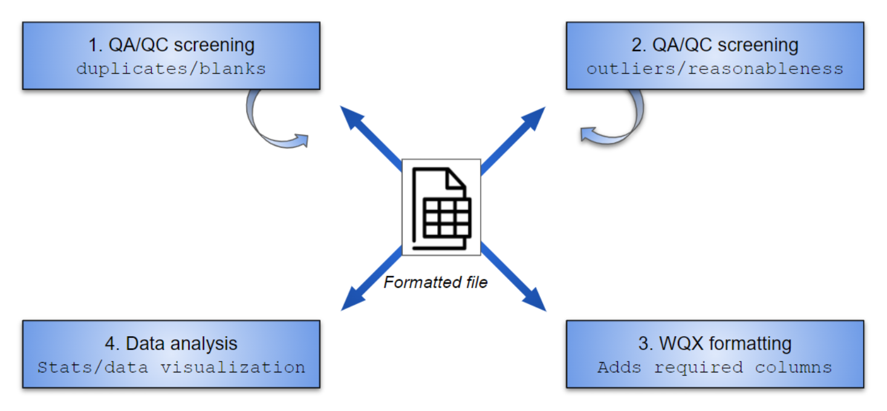

```{r, include = FALSE, message = F, warning = F}
knitr::opts_chunk$set(
  collapse = TRUE,
  comment = "#>", 
  warning = T, 
  message = F, 
  fig.align = "center"
)

library(dplyr)
```

## Overview

The MassWateR R package is developed for surface water monitoring data collected by watershed associations and citizen science groups in Massachusetts. The package is created in collaboration with the [Massachusetts Bays National Estuary Partnership](https://www.mass.gov/orgs/massachusetts-bays-national-estuary-partnership) with funding from an EPA Exchange Network Grant.

The objective of the package is to automate and facilitate quality control and exploratory analysis of data intended for upload to the EPA [Water Quality Exchange](https://www.epa.gov/waterdata/water-quality-data) (WQX). The functions provide a streamlined and repeatable means of 1) screening data for quality control, 2) interpreting data, and 3) creating graphics for analysis and reports to stakeholders. Additional formatting tools are also available to facilitate data upload to WQX. The functions are organized around these topics, shown below.

```{r workflow, out.width = '100%', echo = F, fig.cap = 'Functions in MassWateR are organized around these topics.'}

```

Three types of data are used with the package. All types should be provided to make best use of the functions:

1. Water quality **results** organized by sample location and date.
2. Summary of data quality objectives that describe quality control **accuracy**, **frequency**, and **completeness** measures for data in the results file.
3. A **site metadata** file, including location names, latitude, longitude, and additional grouping factors for sites.
4. A **wqx metadata** file required for generating output to facilitate data upload to WQX 

Templates and instructions for each of the types of input data are available for download in the [Resources tab](/MassWateR/RESOURCES.md). Additionally, example files, described below, are provided with the package to demonstrate and test the functions.

## Installation and example data files

Install the package as follows:

```{r, eval = F}
# Enable universe(s) by massbays-tech
options(repos = c(
  massbaystech = "https://massbays-tech.r-universe.dev",
  CRAN = "https://cloud.r-project.org"))

# Install the package
install.packages("MassWateR")
```

Windows PC users may encounter the following warning when installing MassWateR.

```r
WARNING: Rtools is required to build R packages but is not currently installed. Please download and install the appropriate version of Rtools before proceeding: https://cran.rstudio.com/bin/windows/Rtools/
```

This warning can be ignored for the MassWateR solution.  If desired, RTools can be obtained following the instructions [here](https://cran.rstudio.com/bin/windows/Rtools/).

Load the package in an R session after installation:

```{r}
library(MassWateR)
```

The example files for the package can be viewed by navigating to their location in the package installation. These are available as Excel files.  Running the code below will show where the files are located.

The surface water quality results files:

```{r, eval = F}
system.file("extdata/ExampleResults.xlsx", package = "MassWateR")
```

The data quality objectives file for accuracy:

```{r, eval = F}
system.file("extdata/ExampleDQOAccuracy.xlsx", package = "MassWateR")
```

The data quality objectives file for completeness:

```{r, eval = F}
system.file("extdata/ExampleDQOFrequencyCompleteness.xlsx", package = "MassWateR")
```

The site metadata file:

```{r, eval = F}
system.file("extdata/ExampleSites.xlsx", package = "MassWateR")
```

The wqx metadata file: 

```{r, eval = F}
system.file("extdata/ExampleWQX.xlsx", package = "MassWateR")
```

The example files are provided to demonstrate how the functions in MassWateR are used. In practice, alternative data files that follow the same format as the examples will be used with the functions. There are several checks included in the data import functions to ensure the files are formatted correctly for downstream use. If any of the checks fail, an error message will be returned that prompts the necessary changes that must be made to the Excel file before the data can be used.  The checks can be suppressed by setting `runchk = FALSE` in the import functions.  These checks are described in the next section.

**Make sure to close any data files on your desktop before importing them in MassWateR**.  Some operating systems may require the file to be closed for successful import.  

## Data import and checks

The MassWateR package is developed for quality control and exploratory analysis of surface water quality data. Before these analyses can occur, the data must be formatted correctly. This section describes how to import data and the expectations that are checked automatically by the functions.

For many of the checks, parameter names and units need to match the following columns in the `paramsMWR` file included with the package.  Specifically parameter names (either `Characteristic Name` in the results file, or `Parameter` in the data quality objectives files) can be the simple or WQX format as below.  The units can be any that apply for a given parameter, although only one is allowed per parameter.  All entries are case-sensitive.  This file is also available in the [Resources tab](/MassWateR/RESOURCES.md).

```{r, echo = F}
paramsMWR %>% 
  select(`Simple Parameter`, `WQX Parameter`, `Units of measure`) %>% 
  arrange(`Simple Parameter`) %>% 
  knitr::kable(.)
```

The `readMWRresultsview()` function can be used to help troubleshoot issues that are encountered importing the water quality results file (next section). This function can be used to create a .csv spreadsheet that shows the unique values within columns of the results file.  This information can be used to verify if the values in each conform to the requirements for the data import checks, including acceptable values for the table above.  By default, a .csv is created for all columns.  The `columns` argument can be used to select columns of interest.  Below shows how to view the unique entries for parameters (`"Characteristic Name"`) and units (`"Result Unit"`). By default, the .csv is created in the working directory. The location where the file is saved can be changed using the `output_dir` argument. Visually evaluating the results for conformance to the package requirements and manually editing the input file can help with the import checks, described below.

```{r, eval = F}
# find path to the file included with the package, replace with a path to your file as needed
respth <- system.file("extdata/ExampleResults.xlsx", package = "MassWateR")

# create a .csv file for the two columns that show unique values in each
readMWRresultsview(respth, columns = c("Characteristic Name", "Result Unit"))
```

### Surface water quality results

First, the surface water quality results can be imported with the `readMWRresults()` function. This is designed to import an Excel file external to R, run checks on the data, and provide some minor formatting for downstream quality control or exploratory analysis. In this example, the system file `ExampleResults.xlsx` is imported. In practice, the `pth` argument will point to an external file in the WQX format. See the [Resources tab](/MassWateR/RESOURCES.md) for the Excel file template and detailed instructions. Note that `runchk = TRUE` is set to run the checks on data import.  This is the default setting and it is not necessary to explicitly set this argument on import.

```{r, message = T}
respth <- system.file("extdata/ExampleResults.xlsx", package = "MassWateR")
resdat <- readMWRresults(respth, runchk = TRUE)
head(resdat)
```

Several checks are run automatically when the data are imported. These file checks are as follows (also viewed from the help file for `checkMWRresults()`:

-   **Column name spelling**: Should be the following: Monitoring Location ID, Activity Type, Activity Start Date, Activity Start Time, Activity Depth/Height Measure, Activity Depth/Height Unit, Activity Relative Depth Name, Characteristic Name, Result Value, Result Unit, Quantitation Limit, QC Reference Value, Result Measure Qualifier, Result Attribute.
-   **Columns present**: All columns from the previous should be present, Result Attribute is optional
-   **Activity Type**: Should be one of Field Msr/Obs, Sample-Routine, Quality Control Sample-Field Blank, Quality Control Sample-Lab Blank, Quality Control Sample-Lab Duplicate, Quality Control Sample-Lab Spike, Quality Control Field Calibration Check
-   **Date formats**: Should be mm/dd/yyyy and parsed correctly on import
-   **Non-numeric Activity Depth/Height Measure**: All depth values should be numbers, excluding missing values
-   **Activity Depth/Height Unit**: All entries should be `ft`, `m`, or blank
-   **Activity Relative Depth Name**: Should be either Surface, Bottom, Midwater, Near Bottom, or blank (warning only)
-   **Activity Depth/Height Measure out of range**: All depth values should be less than or equal to 1 meter / 3.3 feet or entered as Surface in the Activity Relative Depth Name column (warning only)
-   **Characteristic Name**: Should match parameter names in the `Simple Parameter` or `WQX Parameter` column of the `paramsMWR` data (warning only)
-   **Result Value**: Should be a numeric value or a text value as AQL or BDL
-   **QC Reference Value**: Any entered values should be numeric or a text value as AQL or BDL
-   **Result Unit**: No missing entries in `Result Unit`, except pH which can be blank
-   **Single Result Unit**: Each unique parameter in `Characteristic Name` should have only one entry in `Result Unit` (excludes entries for lab spikes reported as `%` or `% recovery`)
-   **Correct Result Unit**: Each unique parameter in `Characteristic Name` should have an entry in `Result Unit` that matches one of the acceptable values in the `Units of measure` column of the `paramsMWR` data (excludes entries for lab spikes reported as `%` or `% recovery`), see the table above.

An informative error is returned if the input data fail any of the checks. The input data should be corrected by hand in the Excel file by altering the appropriate rows or column names indicated in the error. Checks with warnings can be fixed at the discretion of the user before proceeding.

Here is an example of an error that might be returned for an incorrect data entry (using the `checkMWRresults()` function, which is used inside of `readMWRresults()`). To remedy the issue, change the entries in row 4 and 135 in the Activity Type column to Sample-Routine and Field Msr/Obs, respectively. This must be done in the original Excel file. Import the data again in R to verify the data are corrected.

```{r, error = T, message = T}
chk <- resdat
chk[4, 2] <- "Sample"
chk[135, 2] <- "Field"
checkMWRresults(chk)
```

Data imported with `readMWRresults()` are also formatted to address a few minor issues for downstream analysis. This formatting includes:

-   **Fix date and time inputs**: Activity Start Date is converted to YYYY-MM-DD as a date object, Activity Start Time is converted to HH:MM as a character to fix artifacts from Excel import.
-   **Minor formatting for Result Unit**: For conformance to WQX, e.g., ppt is changed to ppth, s.u. is changed to `NA`. 
-   **Convert characteristic names**: All parameters in `Characteristic Name` are converted to `Simple Parameter` in `paramsMWR` as needed.

### Data quality objectives

To use the quality control functions in MassWateR, Excel files that describe the data quality objectives for accuracy, frequency, and completeness must be provided. The system files included with the package, described above, demonstrate the required information and format for these files. They can be imported into R using the `readMWRacc()` and `readMWRfrecom()` functions for the accuracy, frequency, and completeness files. The `pth` argument will point to the location of the external files on your computer. See the [Resources tab](/MassWateR/RESOURCES.md) for the Excel file template and detailed instructions. As above, the system files included with the package are used for the examples.

```{r, message = T}
# import data quality objectives for accuracy
accpth <- system.file("extdata/ExampleDQOAccuracy.xlsx", package = "MassWateR")
accdat <- readMWRacc(accpth)
head(accdat)
```

```{r, message = T, warning = T}
# import data quality objectives for frequency and completeness
frecompth <- system.file("extdata/ExampleDQOFrequencyCompleteness.xlsx", package = "MassWateR")
frecomdat <- readMWRfrecom(frecompth)
head(frecomdat)
```

Both the `readMWRacc()` and `readMWRfrecom()` functions will run a series of checks to ensure the imported data are formatted correctly. The `checkMWRacc()` and `checkMWRfrecom()` functions run these checks when the `readMWRacc()` and `readMWRfrecom()` functions are executed, respectively. The checks for each are as follows.

File checks for accuracy:

-   **Column name spelling**: Should be the following: Parameter, uom, MDL, UQL, Value Range, Field Duplicate, Lab Duplicate, Field Blank, Lab Blank, Spike/Check Accuracy
-   **Columns present**: All columns from the previous check should be present
-   **Column types**: All columns should be characters/text, except for MDL and UQL
-   **Unrecognized characters**: Fields describing accuracy checks should not include symbols or text other than $<=$, $\leq$, $<$, $>=$, $\geq$, $>$, $\pm$ \%, BDL, AQL, log, or all
-   **Parameter**: Should match parameter names in the `Simple Parameter` or `WQX Parameter` columns of the `paramsMWR` data
-   **Units**: No missing entries in units (`uom`), except pH which can be blank
-   **Single unit**: Each unique `Parameter` should have only one type for the units (`uom`)
-   **Correct units**: Each unique `Parameter` should have an entry in the units (`uom`) that matches one of the acceptable values in the `Units of measure` column of the `paramsMWR` data, see the table above.
-   **Empty columns**: Columns with all missing or `NA` values will return a warning 

File checks for frequency and completeness:

-   **Column name spelling**: Should be the following: Parameter, Field Duplicate, Lab Duplicate, Field Blank, Lab Blank, Spike/Check Accuracy, % Completeness
-   **Columns present**: All columns from the previous check should be present
-   **Non-numeric values**: Values entered in columns other than the first should be numeric
-   **Values outside of 0 - 100**: Values entered in columns other than the first should not be outside of 0 and 100
-   **Parameter**: Should match parameter names in the `Simple Parameter` or `WQX Parameter` columns of the `paramsMWR` data
-   **Empty columns**: Columns with all missing or `NA` values will return a warning 

Minor formatting of the input files is also done to address a few minor issues for downstream analysis. This formatting includes:

-   **Minor formatting for units**: For conformance to WQX, e.g., ppt is changed to ppth, s.u. is changed to `NA` for the `uom` column (`readMWRacc()` only). 
-   **Convert parameter names**: All parameters in `Parameter` are converted to `Simple Parameter` in `paramsMWR` as needed.
-   **Remove unicode**: Remove or replace unicode characters with those that can be used in logical expressions in `qcMWRacc()`, e.g., replace $\geq$ with $>=$.

### Site metadata

An Excel file for site metadata that describes spatial location and any other grouping factors for the sites in the results file can be imported using `readMWRsites()`. The system file included with the package, described above, demonstrates the required information and format for the file. The `pth` argument will point to the location of the external file on your computer. See the [Resources tab](/MassWateR/RESOURCES.md) for the Excel file template and detailed instructions. As above, the system file included with the package is used for the example.

```{r, message = T}
# import site metadata
sitpth <- system.file("extdata/ExampleSites.xlsx", package = "MassWateR")
sitdat <- readMWRsites(sitpth)
head(sitdat)
```

The `readMWRsites()` function runs several checks on the file using the `checkMWRsites()` function. Most of the checks are to ensure the latitude and longitude data are present and properly formatted. It is assumed that latitude and longitude data are entered in decimal degrees.  The projection can be entered in other functions used in exploratory analysis. Details on the file checks are as follows:

-   **Column name spelling**: Should be the following: Monitoring Location ID, Monitoring Location Name, Monitoring Location Latitude, Monitoring Location Longitude, Location Group
-   **Columns present**: All columns from the previous check should be present
-   **Missing longitude or latitude**: No missing entries in Monitoring Location Latitude or Monitoring Location Longitude
-   **Non-numeric latitude values**: Values entered in Monitoring Location Latitude must be numeric
-   **Non-numeric longitude values**: Values entered in Monitoring Location Longitude must be numeric
-   **Positive longitude values**: Values in Monitoring Location Longitude must be negative
-   **Missing Location ID**: No missing entries for Monitoring Location ID

### WQX metadata

An Excel file for wqx metadata that is required to generate output for upload to WQX can be imported using `readMWRwqx()`. The system file included with the package, described above, demonstrates the required information and format for the file. The `pth` argument will point to the location of the external file on your computer. See the [Resources tab](/MassWateR/RESOURCES.md) for the Excel file template and detailed instructions. As above, the system file included with the package is used for the example.

```{r, message = T}
# import wqx metadata
wqxpth <- system.file("extdata/ExampleWQX.xlsx", package = "MassWateR")
wqxdat <- readMWRwqx(wqxpth)
head(wqxdat)
```

The `readMWRwqx()` function runs a few checks on the file using the `checkMWRwqx()` function. Details on the file checks are as follows:

-   **Column name spelling**: Should be the following: Parameter, Sampling Method Context, Method Speciation, Result Sample Fraction, Analytical Method, Analytical Method Context.
-   **Columns present**: All columns from the previous should be present, Result Attribute is optional
-   **Unique parameters**: Values in `Parameter` should be unique (no duplicates)
-   **Parameter**: Should match parameter names in the `Simple Parameter` or `WQX Parameter` column of the `paramsMWR` data (warning only)

An informative error is returned if the input data fail any of the checks. The input data should be corrected by hand in the Excel file by altering the appropriate rows or column names indicated in the error. Checks with warnings can be fixed at the discretion of the user before proceeding.

## Using the fset argument

All of the [quality control](/MassWateR/articles/qcoverview.md), [outlier](/MassWateR/articles/outlierchecks.md), [analysis](/MassWateR/articles/analysis.md), and [wqx](/MassWateR/articles/wqx.md) functions in MassWateR require the inputs described above, depending on the function.  These are generally passed to each function using the appropriate arguments, e.g., `res` for the surface water quality results, `acc` and `frecom` for the data quality objective files for accuracy, frequency, and completeness, `sit` for the site metadata, and `wqx` for the wqx metadata. The values passed to these functions can be file paths that specify the location of the file (either as a full path or relative path based on the working directory) or as data frames returned by the relevant import functions (i.e., `readMWRresults()`, `readMWRacc()`, `readMWRfrecom()`, `readMWRsites()`, `readMWRwqx()`).

Because it can be tedious to specify each of the input files in the arguments for the MassWateR functions, the `fset` (file set) argument can be used as an alternative method.  The `fset` argument for each function accepts a named list with the relevant input file locations or data frames.  This can be created at the top of a script and recycled as necessary for an analysis workflow.  The examples below demonstrate creating the list as file paths or as exported data frames from the import functions.  Examples in the vignettes show how this list can be used as alternative input using the `fset` argument.   

```{r}
# a list of input file paths
fsetls <- list(
  res = respth, 
  acc = accpth,
  frecom = frecompth,
  sit = sitpth, 
  wqx = wqxpth
)

# a list of input data frames
fsetls <- list(
  res = resdat, 
  acc = accdat,
  frecom = frecomdat,
  sit = sitdat, 
  wqx = wqxdat
)
```

