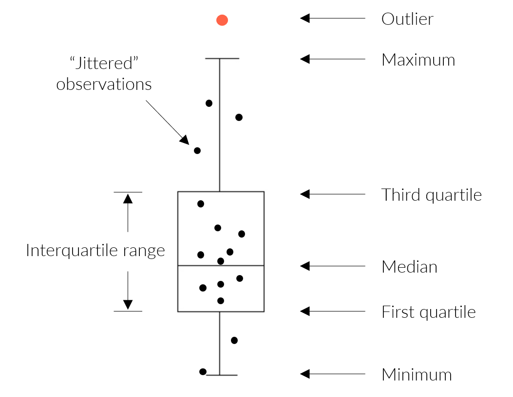

```{r, include = FALSE}
knitr::opts_chunk$set(
  collapse = TRUE,
  comment = "#>", 
  warning = T, 
  message = F
)
```

Outliers can be evaluated once the required data are successfully imported into R (see the [data input and checks vignette](https://massbays-tech.github.io/MassWateR/articles/datainput.html) for an overview).  The results data file that describes the monitoring data for surface waters is required.  The data quality objectives file for accuracy is also required to determine plot axis scaling as arithmetic (linear) or logarithmic. The example data included with the package are imported here to demonstrate how to use the analysis functions:

```{r, message = T}
library(MassWateR)

# import results data
respth <- system.file('extdata/ExampleResults.xlsx', package = 'MassWateR')
resdat <- readMWRresults(respth)

# import accuracy data
accpth <- system.file('extdata/ExampleDQOAccuracy.xlsx', package = 'MassWateR')
accdat <- readMWRacc(accpth)
```

## Analyzing outliers

Outliers can be identified using the `anlzMWRoutlier()` function.  Evaluating data for outliers is a critical step of quality control.  Although outliers are not explicitly evaluated with the formal quality control checks, the function allows a user to quickly identify them for removal or additional follow-up.  Outliers are defined using the standard definition of 1.5 times the interquartile range (the 25th to 75th percentile) of a parameter, depending on the grouping type used for the function.  They are visually identified as points above or below the whiskers in the boxplots that describe distribution of the data, i.e., the box defines the interquartile range, the horizontal line is the median, and the whiskers extend above and below 1.5 times the interquartile range.  

```{r boxplotex, out.width = '70%', echo = F, fig.cap = 'A summary of the distribution statistics shown with a standard boxplot.  Outliers extend beyond the whiskers and are 1.5 times the interquartile range.'}

```

The `anlzMWRoutlier()` function uses the results data as a file path or data frame as input. The results for a selected parameter are shown as boxplots, with the outliers labelled accordingly. Outliers can be shown by month using `type = "month"` or by site using `type = "site"`.  Below, outliers are shown for dissolved oxygen grouped by month.   

```{r, fig.height = 4, fig.width = 8}
anlzMWRoutlier(res = resdat, param = 'DO', acc = accdat, type = 'month')
```

The same data are also grouped by site.

```{r, fig.height = 4, fig.width = 8}
anlzMWRoutlier(res = resdat, param = 'DO', acc = accdat, type = 'site')
```

Results can also be filtered by dates using the `dtrng` argument. Note that the date format must be `YYYY-MM-DD`. 

```{r, fig.height = 4, fig.width = 8}
anlzMWRoutlier(res = resdat, param = 'DO', acc = accdat, type = 'site', dtrng = c('2021-06-01', '2021-07-31'))
```

Points that are not outliers can also be jittered over the boxplots using `jitter = TRUE`. Outlier labels that overlap are also offset by default.  This can be suppressed using `repel = FALSE`. 

```{r, fig.height = 4, fig.width = 8}
anlzMWRoutlier(res = resdat, param = 'DO', acc = accdat, type = 'month', jitter = TRUE, repel = FALSE)
```

The data quality objectives file for accuracy is also used to determine the scaling for the y-axis. Below, the axis for E. Coli is plotting on the log-10 scale automatically.

```{r, fig.height = 4, fig.width = 8}
anlzMWRoutlier(res = resdat, param = 'E.coli', acc = accdat, type = 'month')
```

A data frame of the identified outliers can also be returned by setting `outliers = TRUE`.  This table can be used to identify the outliers in the original data for removal or additional follow-up.

```{r}
anlzMWRoutlier(res = resdat, param = 'DO', acc = accdat, type = 'month', outliers = TRUE)
```

