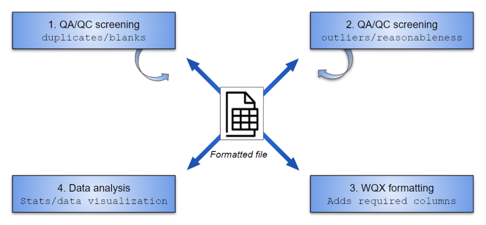

```{r, include = FALSE, message = F, warning = F}
knitr::opts_chunk$set(
  collapse = TRUE,
  comment = "#>", 
  warning = F, 
  message = F, 
  fig.align = 'center'
)

library(dplyr)
```

## Overview

The MassWateR R package is developed to work with surface water monitoring data collected by watershed associations and citizen science groups in Massachusetts. The package is created in collaboration with the [Massachusetts Bays National Estuary Partnership](https://www.mass.gov/orgs/massachusetts-bays-national-estuary-partnership) with funding from an EPA Exchange Network Grant.

The objective of the package is to automate and facilitate quality control and exploratory analysis of data intended for upload to the EPA [Water Quality Exchange](https://www.epa.gov/waterdata/water-quality-data) (WQX). The functions provide a streamlined and repeatable means of 1) screening data for quality control, 2) interpreting data, and 3) creating graphics for analysis and reports to stakeholders. Miscellaneous formatting tools are also available to facilitate data upload to WQZ. The functions are organized around these topics, shown below.

```{r workflow, out.width = '100%', echo = F, fig.cap = 'Functions in MassWateR are organized around these topics.'}

```

Three types of data can be used with the package. All types should be provided to make best use of the functions, although not all are required.

1.  Water quality **results** organized by sample location and date.
2.  Summary of data quality objectives that describe quality control **accuracy** and **completeness** measures for data in the results file.
3.  An optional file of **site metadata**, including location names, latitude, longitude, and additional grouping factors for sites.

The input data should follow standard formats for the WQX network. Example files, described below, are provided with the package to demonstrate the appropriate formats.

## Installation and example data files

Install the package as follows:

```{r, eval = F}
# Enable universe(s) by massbays-tech
options(repos = c(
  massbaystech = 'https://massbays-tech.r-universe.dev',
  CRAN = 'https://cloud.r-project.org'))

# Install the package
install.packages('MassWateR')
```

Load the package in an R session after installation:

```{r}
library(MassWateR)
```

The example files for the package can be viewed by navigating to their location in the package installation. These are available as Excel files.  Running the code below will show where the files are located.

The surface water quality results files:

```{r, eval = F}
system.file('extdata/ExampleResults_final.xlsx', package = 'MassWateR')
```

The data quality objectives file for accuracy:

```{r, eval = F}
system.file('extdata/ExampleDQOAccuracy_final.xlsx', package = 'MassWateR')
```

The data quality objectives file for completeness:

```{r, eval = F}
system.file('extdata/ExampleDQOCompleteness_final.xlsx', package = 'MassWateR')
```

The site metadata file:

```{r, eval = F}
system.file('extdata/ExampleSites_final.xlsx', package = 'MassWateR')
```

The example files are provided to demonstrate how the functions in MassWateR are used. In practice, alternative data files that follow the same format as the examples can be used with the functions. There are several checks included in the data import functions to ensure the files are formatted correctly for downstream use. If any of the checks fail, an error message will be returned that prompts the necessary changes that must be made to the Excel file before the data can be used.  The checks can be suppressed by setting `runchk = FALSE` in the import functions.  These checks are described in the next section.

## Data import and checks

The MassWateR package is developed for quality control and exploratory analysis of surface water quality data. Before these analyses can occur, the data must be formatted correctly. This section describes how to import data and the expectations that are checked automatically by the functions.

### Surface water quality results

First, the surface water quality results can be imported with the `read_results()` function. This is designed to import an Excel file external to R, run checks on the data, and provide some minor formatting for downstream quality control or exploratory analysis. In this example, the system file `ExampleResults_final.xlsx` is imported. In practice, the `pth` argument will point to an alternative external file in the WQX format.  Note that `runchk = TRUE` is set to run the checks on data import.  This is the default setting and it is not necessary to explicitly set this argument on import.

```{r, message = T}
respth <- system.file('extdata/ExampleResults_final.xlsx', package = 'MassWateR')
resdat <- read_results(respth, runchk = TRUE)
head(resdat)
```

Several checks are run automatically when the data are imported. These checks are as follows (also viewed from the help file for `check_results()`:

-   **Column name spelling**: Should be the following: Monitoring Location ID, Activity Type, Activity Start Date, Activity Start Time, Activity Depth/Height Measure, Activity Depth/Height Unit, Relative Depth Category, Characteristic Name, Result Value, Result Unit, Quantitation Limit, QC Reference Value, Result Measure Qualifier, Result Attribute.
-   **Columns present**: All columns from the previous should be present, Result Attribute is optional
-   **Activity Type**: Should be one of Field Msr/Obs, Sample-Routine, Quality Control Sample-Field Blank, Quality Control Sample-Lab Blank, Quality Control Sample-Lab Duplicate, Quality Control Sample-Lab Spike
-   **Date formats**: Should be mm/dd/yyyy and parsed correctly on import
-   **Time formats**: Should be HH:MM and parsed correctly on import
-   **Relative Depth Category**: Should be either Surface, Bottom, \< 1m / 3.3ft or blank
-   **Characteristic Name**: Should match parameter names in the `Simple Parameter` column of the `params()` data, specifically Air Temp, Ammonia, Ammonium, Chl a, Chl a (probe), Chloride, Conductivity, Cyanobacteria (lab), Cyanobacteria (probe), Depth, DO, DO saturation, E.coli, Enterococcus, Fecal Coliform, Flow, Gage, Metals, Microcystins, Nitrate, Nitrate + Nitrite, Nitrite, Ortho P, pH, Pheophytin, Phosphate, PON, POP, Salinity, Secchi Depth, Silicate, Sp Conductance, Sulfate, Surfactants, TDS, TKN, TN, TP, TSS, Turbidity, or Water Temp
-   **Result Value**: Should be a numeric value or a text value as AQL or BDL
-   **QC Reference Value**: Any entered values should be numeric
-   **Result Unit**: No missing entries in `Result Unit`, except pH which can be blank
-   **Single Result Unit**: Each unique parameter in `Characteristic Name` should have only one entry in `Result Unit`
-   **Correct Result Unit**: Each unique parameter in `Characteristic Name` should have an entry in `Result Unit` that matches one of the acceptable values in the `Units of measure` column of the `params()` data, as below: 
     ```{r, echo = F}
params %>% 
  select(`Characteristic Name` = `Simple Parameter`, `Acceptable Result Units` = `Units of measure`) %>% 
  arrange(`Characteristic Name`) %>% 
  knitr::kable(.)
     ```

An informative error is returned if the input data fail any of the checks. The input data should be corrected by hand in the Excel file by altering the appropriate rows or column names indicated in the error.

Here is an example of an error that might be returned for an incorrect data entry (using the `check_results()` function, which is used inside of `read_results()`). To remedy the issue, change the entries in row 4 and 135 in the Activity Type column to Sample-Routine and Field Msr/Obs, respectively. This must be done in the original Excel file. Import the data again in R to verify the data are corrected.

```{r, error = T, message = T}
respth <- system.file('extdata/ExampleResults_final.xlsx', package = 'MassWateR')
resdat <- readxl::read_excel(respth)
chk <- resdat
chk[4, 2] <- 'Sample'
chk[135, 2] <- 'Field'
check_results(chk)
```

Data imported with `read_results()` are also formatted to take care of a few minor issues for downstream analysis. This formatting includes:

-   **Fix date and time inputs**: Activity Start Date is converted to YYYY-MM-DD as a date object, Activity Start Time is converted to HH:MM as a character to fix artifacts from Excel import.
-   **Create duplicate rows for entries in QC Reference Value**: This is done if a value is found in the QC Reference Value column by creating a "new" row with the same location, date, time, etc as the original but with an appropriate quality control entry for the Activity Type.
-  **Remove non-text or math symbols and other minor formatting for Result Unit**: For conformance to WQX, e.g., the degree symbols for degrees C/F is changed to "deg", ppt is changed to ppth, s.u. is changed to NA. 

### Data quality objectives

To use the quality control functions in MassWateR, Excel files that describe the data quality objectives for accuracy and completeness must be provided. The system files included with the package, described above, demonstrate the required information and format for these files. They can be imported into R using the `read_dqoaccuracy()` and `read_dqocompleteness()` functions for the accuracy and completeness files, respectively. The `pth` argument will point to the location of the external files on your computer. As above, the system files included with the package are used for the examples.

```{r, message = T}
# import data quality objectives for accuracy
dqoaccpth <- system.file('extdata/ExampleDQOAccuracy_final.xlsx', package = 'MassWateR')
dqoaccdat <- read_dqoaccuracy(dqoaccpth)
head(dqoaccdat)
```

```{r, message = T}
# import data quality objectives for completeness
dqocompth <- system.file('extdata/ExampleDQOCompleteness_final.xlsx', package = 'MassWateR')
dqocomdat <- read_dqocompleteness(dqocompth)
head(dqocomdat)
```

Both the `read_dqoaccuracy()` and `read_dqocompleteness()` functions will run a series of checks to ensure the imported data are formatted correctly. The `check_dqoaccuracy()` and `check_dqocompleteness()` functions run these checks when the `read_dqoaccuracy()` and `read_dqocompleteness()` functions are executed, respectively. The checks for each are as follows.

Checks for accuracy:

-   **Column name spelling**: Should be the following: Parameter, uom, MDL, UQL, Value Range, Field Duplicate, Lab Duplicate, Field Blank, Lab Blank, Spike/Check Accuracy
-   **Columns present**: All columns from the previous check should be present
-   **Non-numeric values in MDL, UQL**: Values entered in columns MDL and UQL should be numeric
-   **Unrecognized characters**: Fields describing accuracy checks should not include symbols or text other than $<=$, $\leq$, $<$, $>=$, $\geq$, $>$, $\pm$ \%, BDL, AQL, log, or all

Checks for completeness:

-   **Column name spelling**: Should be the following: Parameter, Field Duplicate, Lab Duplicate, Field Blank, Lab Blank, Spike/Check Accuracy, % Completeness
-   **Columns present**: All columns from the previous check should be present
-   **Non-numeric values**: Values entered in columns other than the first should be numeric
-   **Values outside of 0 - 100**: Values entered in columns other than the first should not be outside of 0 and 100

### Site metadata

An Excel file for site metadata that describes spatial location and any other grouping factors for the sites in the results file can be imported using `read_sites()`. The system file included with the package, described above, demonstrates the required information and format for the file. The `pth` argument will point to the location of the external file on your computer. As above, the system file included with the package is used for the example.

```{r, message = T}
# import site metadata
sitpth <- system.file('extdata/ExampleSites_final.xlsx', package = 'MassWateR')
sitdat <- read_sites(sitpth)
head(sitdat)
```

The `read_sites()` functions runs several checks on the file using the `check_sites()` function. Most of the checks are to ensure the latitude and longitude data are present and properly formatted. It is assumed that latitude and longitude data are entered in decimal degrees.  The projection can be entered in other functions used in exploratory analysis. Details on the checks are as follows:

-   **Column name spelling**: Should be the following: Monitoring Location ID, Monitoring Location Name, Monitoring Location Latitude, Monitoring Location Longitude, Location Group
-   **Columns present**: All columns from the previous check should be present
-   **Missing longitude or latitude**: No missing entries in Monitoring Location Latitude or Monitoring Location Longitude
-   **Non-numeric latitude values**: Values entered in Monitoring Location Latitude must be numeric
-   **Non-numeric longitude values**: Values entered in Monitoring Location Longitude must be numeric
-   **Positive longitude values**: Values in Monitoring Location Longitude must be negative
-   **Missing Location ID**: No missing entries for Monitoring Location ID
