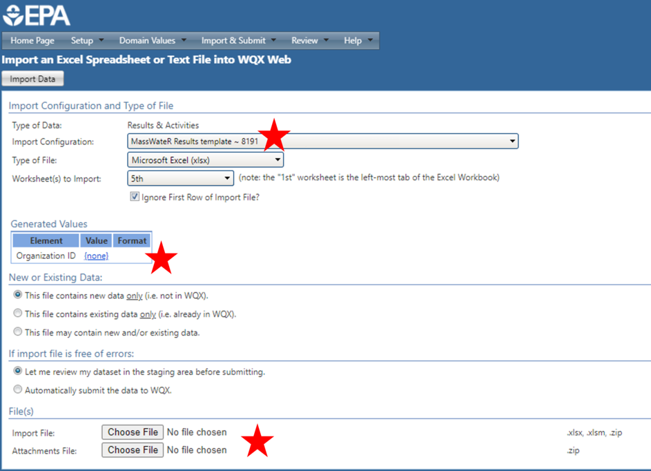

```{r, include = FALSE, message = F, warning = F}
knitr::opts_chunk$set(
  collapse = TRUE,
  comment = "#>",
  warning = T, 
  message = F
)
```

The MassWateR package includes additional tools for generating output that will facilitate upload of data to the EPA [Water Quality Exchange](https://www.epa.gov/waterdata/water-quality-data){target="_blank"} (WQX).  The function for generating the WQX output can be used once the required data are successfully imported into R (see the [data input and checks vignette](https://massbays-tech.github.io/MassWateR/articles/inputs.html) for an overview).  The results data file, the data quality objectives file for accuracy, the site metadata, and the wqx metadata files are required to use these functions.  The example data included with the package are imported here to demonstrate how to use the analysis functions:

```{r, message = T}
library(MassWateR)

# import results data
respth <- system.file("extdata/ExampleResults.xlsx", package = "MassWateR")
resdat <- readMWRresults(respth)

# import accuracy data
accpth <- system.file("extdata/ExampleDQOAccuracy.xlsx", package = "MassWateR")
accdat <- readMWRacc(accpth)

# import site metadata
sitpth <- system.file("extdata/ExampleSites.xlsx", package = "MassWateR")
sitdat <- readMWRsites(sitpth)

# import wqx metadata
wqxpth <- system.file("extdata/ExampleWQX.xlsx", package = "MassWateR")
wqxdat <- readMWRwqx(wqxpth)
```

## Generating output for WQX

The single function for generating output for upload to WQX is `tabMWRwqx()`.  This function will export a single Excel workbook with three sheets, named "Project", "Locations", and "Results". The output is populated with as much content as possible based on information in the input files.  The remainder of the information not included in the output will need to be manually entered before uploading the data to WQX.  All required columns are present, but individual rows will need to be verified for completeness.  It is the responsibility of the user to verify this information is complete and correct before uploading the data. 

The workflow for using this function is to import the required data (results, data quality objectives file for accuracy, site metadata, and wqx metadata, as above) and to fix any errors noted on import prior to creating the output. The function can be used with inputs as paths to the relevant files or as data frames returned by `readMWRresults()`, `readMWRacc()`, `readMWRsites()`, and `readMWRwqx()`.  For the former, the full suite of data checks can be evaluated with `runkchk = T` (default) or suppressed with `runchk = F`, as explained in the relevant help files.  In the latter case, downstream analyses may not work if data are formatted incorrectly. 

The workbook can be created as follows by including the required files and specifying an output directory where the Excel file is saved (a temporary directory is used here). Once the function is done running, a message indicating success and where the file is located is returned. The Excel file can be further edited by hand as needed.  

```{r, message = T}
tabMWRwqx(res = resdat, acc = accdat, sit = sitdat, wqx = wqxdat, output_dir = tempdir())
```

As a convenience, the input files can also be passed to the `tabMWRwqx()` function as a named list using the `fset` argument.  This eliminates the need to individually specify the input arguments. 

```{r, eval = F}
# names list of inputs
fsetls <- list(
  res = resdat, 
  acc = accdat, 
  sit = sitdat,
  wqx = wqxdat
)

tabMWRwqx(fset = fsetls, output_dir = tempdir())
```

The name of the output file can also be changed using the `output_file` argument, the default being `wqxtab.xlsx`.  Warnings can also be turned off or on (default) using the `warn` argument.  This returns any warnings when data are imported and only applies if the file inputs are paths.

If preferred, the data frames that are saved as separate sheets in the workbook can be returned as a list by setting `listout = T`.

```{r}
tabMWRwqx(fset = fsetls, listout = T)
```

## Submitting data to Mass DEP

If you are submitting your data to Mass DEP, you must follow all of their instructions as described on their [External Data Submittal](https://www.mass.gov/guides/external-data-submittals-to-the-watershed-planning-program){target="_blank"} webpage. Data and QC data can be submitted using either the MassDEP data submission template OR by uploading data to WQX. If you are submitting through WQX you should complete the submission by notifying Mass DEP via email ([WQData.Submit@mass.gov](mailto:WQData.Submit@mass.gov){target="_blank"}).  The e-mail must include the group name / project name under which the data was submitted to WQX, a copy of the project QAPP (if not already submitted), a statement of data integrity, the MassWateR QC Report (with the raw data print out), and any other supporting data reports.

## Uploading data to WQX

If desired, all rows from the WQX output file (created with `tabMWRwqx()`) can be copied and pasted into the [WQX upload template](https://github.com/massbays-tech/MassWateR/raw/refs/heads/main/inst/extdata/WQX_Phys-Chem_Template_for_MassWateR.xlsx) (also available on the [Resources](https://massbays-tech.github.io/MassWateR/RESOURCES.html) tab), which offers an enhanced spreadsheet layout with more interactive functionality (e.g., drop-down lists, prompts) and additional tabs with supporting information (e.g., instructions, field definitions). This template is especially useful if manual edits to the data are needed prior to WQX upload.

To upload data to WQX, you will need to create or sign into [your WQX account](https://www.epa.gov/waterdata/wqx-web-account-registration){target="_blank"}. From there, you can upload your Projects, Locations, and Results spreadsheets individually. Note that Projects and Locations need only be uploaded once for your organization, unless the data change. For each spreadsheet upload, assign the appropriate MassWateR custom import configuration, check that your Organization ID is assigned, browse to your upload file, and select Import Data (image below). The next screen will notify you of upload status and prompt you to correct any errors or warnings that arise. More information on error resolution can be found in the [WQX User Guide](https://www.epa.gov/sites/default/files/2020-03/documents/wqx_web_user_guide_v3.0.pdf){target="_blank"}.

```{r wqximport, out.width = '100%', echo = F}

```
